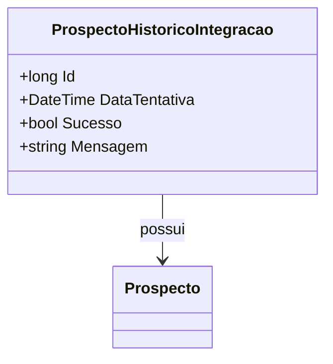

# ProspectoHistoricoIntegracao

**Namespace**: IsthmusWinthor.Dominio.Entidades  
**Nome do Arquivo**: ProspectoHistoricoIntegracao.cs

## Visão Geral e Responsabilidade
A classe `ProspectoHistoricoIntegracao` representa o histórico de tentativas de integração de um prospecto no sistema. Sua principal responsabilidade é registrar informações sobre cada tentativa de sincronização ou atualização de dados relacionados a um prospecto. Isso permite rastrear o sucesso ou falha das operações de integração, ajudando a identificar padrões e resolver problemas. Essa classe é essencial para garantir a integridade dos dados ao longo do processo de integração.

## Métodos de Negócio
- **Título**: Não possui métodos de negócio com lógica complexa.  
Os métodos relacionados são mais voltados ao transporte de dados e mapeamento.

## Propriedades Calculadas e de Validação
- Não há propriedades calculadas ou de validação na classe `ProspectoHistoricoIntegracao`.

## Navigations Property
- [Prospecto](Prospecto.md) - Representa o prospecto associado ao histórico de integração.

## Tipos Auxiliares e Dependências
- Esta classe não depende de nenhum enumerador ou classe auxiliar estática.

## Diagrama de Relacionamentos

---
Gerada em 29/12/2025 20:45:43
