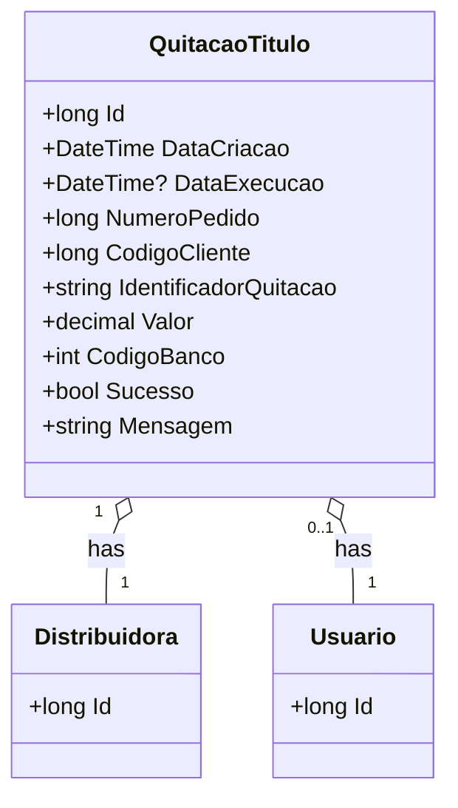

# QuitacaoTitulo

**Namespace**: IsthmusWinthor.Dominio.Entidades  
**Nome do Arquivo**: QuitacaoTitulo.cs  

## Visão Geral e Responsabilidade
A classe `QuitacaoTitulo` atua como um motor de cálculo para gerenciar a quitação de títulos financeiros dentro do sistema. Ela é responsável por armazenar detalhes relacionados à quitação, como as informações da distribuidora, dados da execução, valores envolvidos e status de sucesso da operação. Este modelo garante que as informações de quitação sejam registradas de maneira consistente e precisa, ajudando no controle financeiro e na auditoria das operações.

## Métodos de Negócio
### Título: QuitacaoTitulo(ContaPix) - Construtor

- **Objetivo**: Garantir a criação de uma quitação de título a partir de um objeto `ContaPix`, preenchendo todas as propriedades necessárias para o registro da quitação.
- **Comportamento**: 
  1. Recebe um objeto do tipo `ContaPix`.
  2. Atribui o `DistribuidoraId` do `ContaPix` à propriedade correspondente da quitação.
  3. Extrai e atribui o `NumeroPedido` do `ContaPix` à quitação.
  4. Extrai e atribui o `CodigoCliente` do `ContaPix` à quitação.
  5. Chama o método `ValorPagoConta()` do `ContaPix` para determinar o valor que está sendo quitado e o atribui à propriedade `Valor`.
  6. Atribui o `CodigoBanco` referente ao `ConvenioPixCredencial` do `ContaPix`.
  7. Inicializa `DataCriacao` com a data e hora atuais.
- **Retorno**: Não aplica, pois é um construtor.

## Propriedades Calculadas e de Validação
Nenhuma propriedade na classe `QuitacaoTitulo` apresenta lógica de cálculo ou validação no `get` ou `set`.

## Navigation Properties
- [Distribuidora](Distribuidora.md)
- [Usuario](Usuario.md)

## Tipos Auxiliares e Dependências
- Enum: [CodigoBanco](CodigoBanco.md) (presumido para o código do banco).
- Classe Utilitária: [DateTimeUtil](DateTimeUtil.md) (para manipulação de datas).

## Diagrama de Relacionamentos

---
Gerada em 29/12/2025 20:45:56
