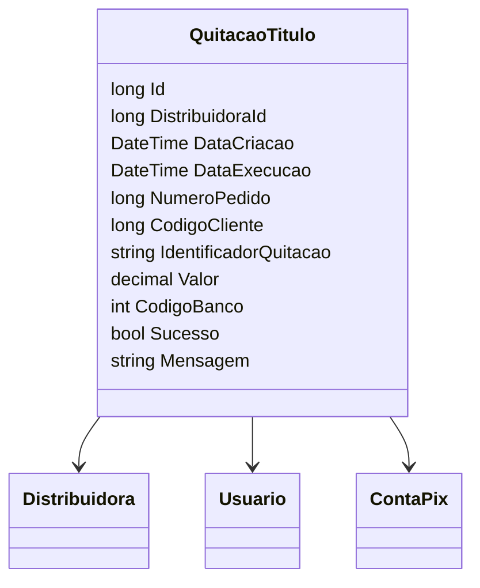

# QuitacaoTitulo

**Namespace**: IsthmusWinthor.Dominio.Entidades  
**Nome do Arquivo**: QuitacaoTitulo.cs  

## Visão Geral e Responsabilidade
A classe `QuitacaoTitulo` representa o processo de quitação de títulos no sistema, encapsulando as informações necessárias para registrar essa operação financeira. Ela aborda a necessidade de validar e armazenar informações essenciais sobre a quitação, como valores, datas de execução e status, contribuindo para a integridade do sistema financeiro da organização.

## Métodos de Negócio

### Título: QuitacaoTitulo(ContaPix) - Construtor

- **Objetivo**: Este construtor garante a criação de uma nova quitação vinculada a uma conta PIX, preenchendo automaticamente as propriedades fundamentais da quitação com dados relevantes da conta.
- **Comportamento**:
  1. Recebe um objeto `ContaPix` como parâmetro.
  2. Extrai e define o `DistribuidoraId` a partir da conta PIX.
  3. Obtém e define o `NumeroPedido` com o número do pedido presente da conta PIX.
  4. Atribui o `CodigoCliente` com base nos dados do cliente associado ao pedido.
  5. Invoca o método `ValorPagoConta()` da `ContaPix` para calcular o valor da quitação.
  6. Atribui o `CodigoBanco` baseado na credencial de banco da conta PIX.
  7. Define a `DataCriacao` com a data e hora atuais através de `DateTimeUtil.Now`.
- **Retorno**: Não aplicável, pois é um construtor.

## Propriedades Calculadas e de Validação
- **Valor**: Representa o valor a ser quitado. A regra de negócio por trás é que deve ser um valor positivo, correspondente ao montante pago na quitação.
- **DataCriacao**: Define a data em que a quitação foi criada. Deve sempre ser a data atual, garantindo rastreabilidade da operação.

## Navigations Property
- `[Distribuidora](Distribuidora.md)`: Representa a distribuidora associada à quitação.
- `[Usuario](Usuario.md)`: Refere-se ao usuário que solicitou a quitação, se aplicável.

## Tipos Auxiliares e Dependências
- `[ContaPix](ContaPix.md)`: Classe utilizada para coletar informações sobre a quitação.
- `[DateTimeUtil](DateTimeUtil.md)`: Classe utilitária usada para manipulação de data e hora.

## Diagrama de Relacionamentos

Essa documentação fornece uma visão geral clara sobre a classe `QuitacaoTitulo`, suas responsabilidades e como ela se integra ao restante do sistema. Regras de negócio e a estrutura da classe foram detalhadas para facilitar a compreensão e manutenção para futuros desenvolvedores.
