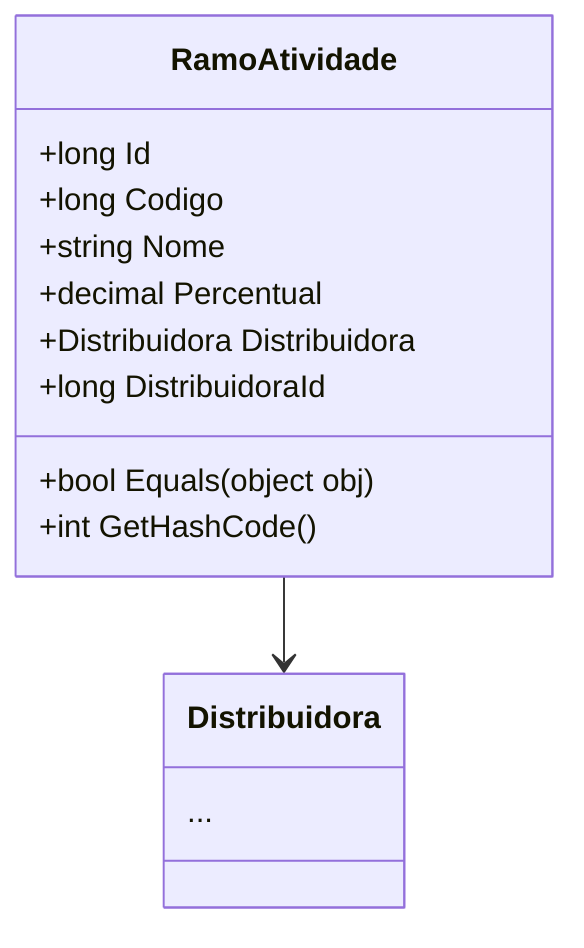

# RamoAtividade
**Namespace**: IsthmusWinthor.Dominio.Entidades  
**Nome do Arquivo**: RamoAtividade.cs  

## Visão Geral e Responsabilidade
A classe `RamoAtividade` representa um ramo de atividade de uma distribuidora no sistema, encapsulando informações relevantes como o código, nome e percentual associado à atividade. Essa classe atua como um Rich Domain Model, garantindo que as operações relacionadas a ramos de atividade sejam realizadas de forma consistente em relação à identidade e associações do domínio.

## Métodos de Negócio
### Título: Equals e Visibilidade: override
- **Objetivo**: Garantir que duas instâncias de `RamoAtividade` sejam consideradas iguais com base no `Codigo` e `DistribuidoraId`. Isso é importante para a integridade de dados ao lidar com coleções de ramos de atividades que podem conter objetos duplicados.
- **Comportamento**: 
  1. O método verifica se o objeto passado é do tipo `RamoAtividade`.
  2. Em seguida, compara os valores do `Codigo` e `DistribuidoraId` com o objeto atual.
  3. Retorna `true` se ambos os valores forem iguais, caso contrário, `false`.
- **Retorno**: Retorna um valor booleano que indica se os dois objetos têm igualdade com base nos critérios definidos.

### Título: GetHashCode e Visibilidade: override
- **Objetivo**: Fornecer um código hash consistente para a instância de `RamoAtividade`, utilizado em coleções baseadas em hash, como `HashSet` ou como chaves de dicionários. Isso previne conflitos e melhora a performance em operações de busca.
- **Comportamento**: 
  1. Combina os valores de `Codigo` e `DistribuidoraId` utilizando o método `HashCode.Combine`.
  2. Retorna o código hash resultante.
- **Retorno**: Retorna um inteiro que representa o código hash da instância.

## Propriedades Calculadas e de Validação
Nenhuma propriedade na classe `RamoAtividade` possui lógica no `get` ou validações no `set`. As propriedades são definidas com acesso direto.

## Navigations Property
- `Distribuidora`: [Distribuidora](Distribuidora.md)

## Tipos Auxiliares e Dependências
Não há enumeradores ou classes auxiliares diretamente utilizadas na classe `RamoAtividade`.

## Diagrama de Relacionamentos

---
Gerada em 29/12/2025 20:46:08
