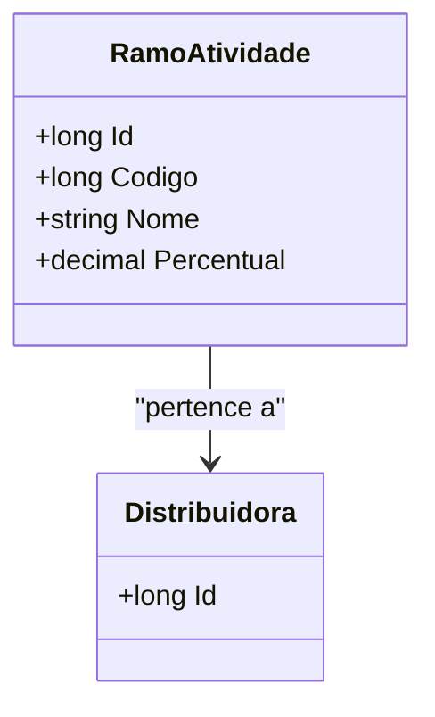

# RamoAtividade
- **Namespace**: IsthmusWinthor.Dominio.Entidades
- **Nome do Arquivo**: RamoAtividade.cs

## Visão Geral e Responsabilidade
A classe `RamoAtividade` representa um ramo de atividade no contexto de uma distribuidora, encapsulando informações cruciais como o código, nome e percentual associado a essa atividade. A responsabilidade principal desta classe é garantir a integridade e identificação dos ramos de atividade na estrutura de dados do sistema corporativo, trabalhando diretamente com as associações de distribuidoras. Isso ajuda a resolver o problema de categorização e organização de atividades dentro da lógica de negócios da aplicação.

## Métodos de Negócio
*Nota: A classe não possui métodos com lógica complexa para descrição, somente `Equals` e `GetHashCode`, que são métodos padrão de comparação e não contém regras de negócio específicas.*

## Propriedades Calculadas e de Validação
- Esta classe não possui propriedades que incluam lógica no `get` ou validação no `set`. As propriedades são anêmicas e utilizam-se apenas de getters e setters simples.

## Navigation Property
- `Distribuidora`: representa uma associação com o domínio da distribuidora. 
  - Link: `[Distribuidora](Distribuidora.md)`

## Tipos Auxiliares e Dependências
- Esta classe não utiliza tipos auxiliares ou enums especificados. 

## Diagrama de Relacionamentos

