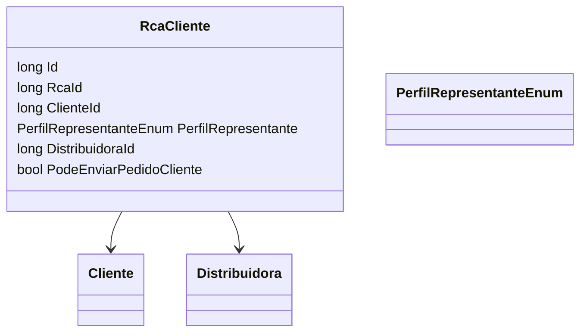

# RcaCliente
**Namespace**: IsthmusWinthor.Dominio.Entidades  
**Nome do Arquivo**: RcaCliente.cs  

## Visão Geral e Responsabilidade
A classe `RcaCliente` representa uma entidade no domínio que associa um representante de vendas (RCA) a um cliente específico, incluindo informações sobre o perfil do representante e as permissões de envio de pedidos. Este modelo é crucial para garantir que apenas RCAs autorizados possam realizar ações específicas em nome de determinados clientes, ajudando a manter a integridade dos processos de vendas e distribuição.

## Métodos de Negócio
- **Título**: (Nenhum método de negócio implementado para esta classe)

## Propriedades Calculadas e de Validação
- **PodeEnviarPedidoCliente**: Essa propriedade booleana determina se o representante de vendas (RCA) tem permissão para enviar pedidos em nome do cliente. A lógica de validação não está explicitada no código, mas seu estado deve ser definido de acordo com regras de negócio que possam incluir condições relacionadas ao perfil do representante e ao estado do cliente.

## Navigations Property
- `Cliente`: [Cliente](Cliente.md) - Representa o cliente associado ao RCA.
- `Distribuidora`: [Distribuidora](Distribuidora.md) - Representa a distribuidora associada ao RCA.

## Tipos Auxiliares e Dependências
- `PerfilRepresentanteEnum`: [PerfilRepresentanteEnum](PerfilRepresentanteEnum.md) - Enum que define os diferentes perfis que um representante pode ter.

## Diagrama de Relacionamentos

---
Gerada em 29/12/2025 20:46:17
