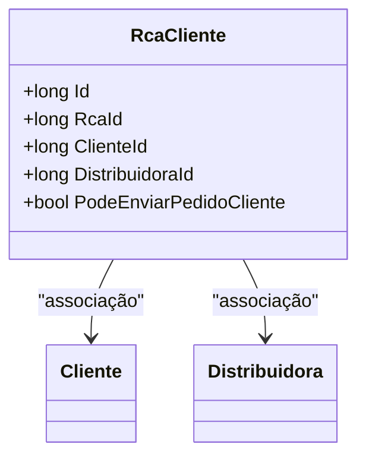

# RcaCliente
**Namespace**: IsthmusWinthor.Dominio.Entidades  
**Nome do Arquivo**: RcaCliente.cs  

## Visão Geral e Responsabilidade
A classe `RcaCliente` representa uma entidade que mapeia a relação entre um representante (RCA) e um cliente no sistema. Ela é responsável por armazenar as informações relevantes que permitem a gestão do relacionamento entre distribuidoras e seus clientes, garantindo que as operações essenciais de envio de pedidos sejam realizadas de forma adequada, com base em permissões definidas.

## Métodos de Negócio
A classe `RcaCliente` não possui métodos de negócio com lógica complexa, pois se limita a encapsular dados relacionados a um cliente e suas permissões.

## Propriedades Calculadas e de Validação
As propriedades em `RcaCliente` não possuem lógica complexa em seus acessadores, mas a propriedade `PodeEnviarPedidoCliente` determina se um representante pode ou não enviar pedidos em nome de um cliente, sendo uma propriedade booleana que reflete essa regra.

## Navigations Property
- [Cliente](Cliente.md)
- [Distribuidora](Distribuidora.md)

## Tipos Auxiliares e Dependências
- [PerfilRepresentanteEnum](PerfilRepresentanteEnum.md)

## Diagrama de Relacionamentos

