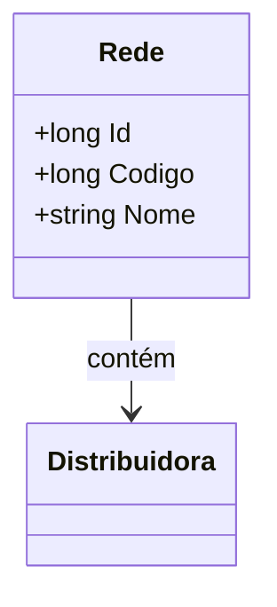

# Rede
**Namespace**: IsthmusWinthor.Dominio.Entidades  
**Nome do Arquivo**: Rede.cs  

## Visão Geral e Responsabilidade
A classe `Rede` representa uma entidade do domínio que modela as redes comerciais relacionadas a distribuidoras. O papel dessa classe é gerenciar as informações básicas sobre redes, atuando como uma raiz de agregado que permite a manipulação e consulta das características de uma rede em relação a sua distribuidora associada. Esta implementação garante a integridade dos dados ao assegurar que cada rede está vinculada a uma única distribuidora, facilitando operações relacionadas a conexões e relações comerciais.

## Propriedades Calculadas e de Validação
A classe `Rede` não possui propriedades calculadas ou de validação complexas, já que suas propriedades são simples e não incluem lógica adicional na definição.

## Navigation Properties
- [`Distribuidora`](Distribuidora.md): Representa a distribuidora associada a esta rede. Propriedade complexa essencial que estabelece a relação entre uma rede e a distribuidora.

## Tipos Auxiliares e Dependências
- **Enums e Classes Auxiliares**: Esta classe não depende de enums ou classes estáticas/hackers específicas.

## Diagrama de Relacionamentos

