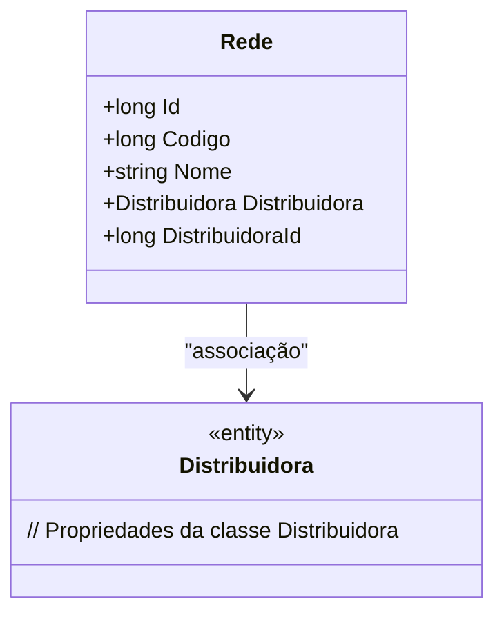

# Rede
**Namespace**: IsthmusWinthor.Dominio.Entidades  
**Nome do Arquivo**: Rede.cs  

## Visão Geral e Responsabilidade
A classe `Rede` representa uma estrutura que encapsula informações sobre redes dentro do contexto de uma distribuidora de produtos. Ela atua como um modelo de domínio que liga a entidade `Rede` a uma `Distribuidora`, permitindo o gerenciamento e a identificação das redes de distribuição que a empresa possui. Isso é crucial para garantir que as operações de distribuição sejam eficazes e que a informação sobre cada rede esteja organizada e acessível.

## Métodos de Negócio
### (Nenhum método com lógica foi encontrado nesta classe)

## Propriedades Calculadas e de Validação
### (Nenhuma propriedade com lógica no get ou validação no set foi encontrada nesta classe)

## Navigations Property
- [Distribuidora](Distribuidora.md)

## Tipos Auxiliares e Dependências
- Nenhum enumerador ou classe auxiliar foi identificado dentro da classe `Rede`.

## Diagrama de Relacionamentos

---
Gerada em 29/12/2025 20:46:23
