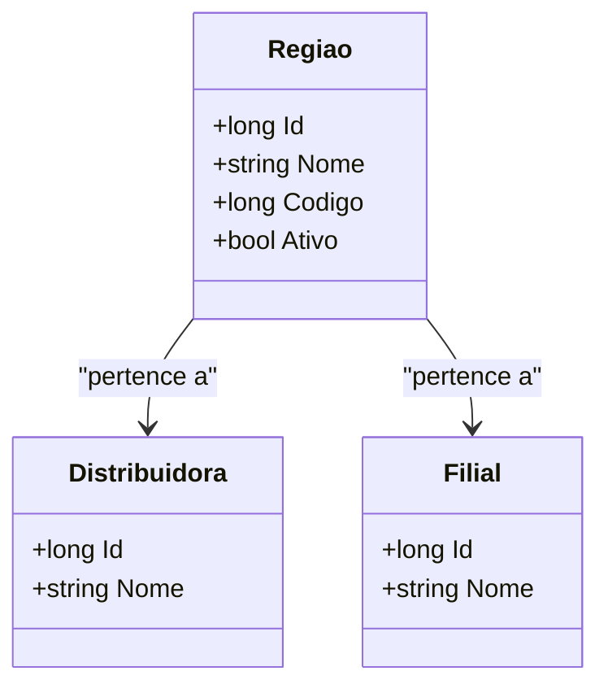

# Regiao

**Namespace**: IsthmusWinthor.Dominio.Entidades  
**Nome do Arquivo**: Regiao.cs  

## Visão Geral e Responsabilidade
A classe `Regiao` é um Rich Domain Model que representa uma região geográfica dentro do sistema, associada a uma distribuidora e a uma filial. Sua responsabilidade principal é garantir a integridade dos dados relacionados à identificação e vinculação de regiões com as entidades de `Distribuidora` e `Filial`, assegurando que cada região possua um código único dentro do contexto de sua distribuidora. Além disso, ela implementa regras de igualdade que são essenciais para a comparação de instâncias de regiões.

## Métodos de Negócio

### Título: Equals (override) 
- **Visibilidade**: Public  
- **Objetivo**: Garante que duas instâncias de `Regiao` sejam consideradas iguais se compartilham o mesmo `Codigo` e `DistribuidoraId`.  
- **Comportamento**: 
  1. Verifica se o objeto comparado é uma instância de `Regiao`.
  2. Compara o `Codigo` da instância atual com o `Codigo` da instância comparada.
  3. Compara o `DistribuidoraId` da instância atual com o `DistribuidoraId` da instância comparada.
  4. Retorna `true` se ambos os critérios acima forem atendidos, caso contrário, retorna `false`.
- **Retorno**: Um valor booleano que indica se as duas regiões são iguais.

### Título: GetHashCode (override) 
- **Visibilidade**: Public  
- **Objetivo**: Garante que a implementação do hash code da classe combine o `Codigo` e o `DistribuidoraId` para permitir uma busca consistente em coleções que utilizam hash.  
- **Comportamento**: 
  1. Combina o `Codigo` e o `DistribuidoraId` usando o método estático `HashCode.Combine`.
  2. Retorna um valor inteiro que representa o hash da região.
- **Retorno**: Um valor numérico que é usado como identificador hash da instância.

## Propriedades Calculadas e de Validação
As propriedades não contêm lógica de cálculo ou validação em `get` ou `set`.

## Navigations Property
- `Distribuidora`: [Distribuidora](Distribuidora.md)
- `Filial`: [Filial](Filial.md)

## Tipos Auxiliares e Dependências
- Não há enumeradores ou classes estáticas/helpers referenciadas diretamente na classe `Regiao`.

## Diagrama de Relacionamentos

---
Gerada em 29/12/2025 20:46:34
