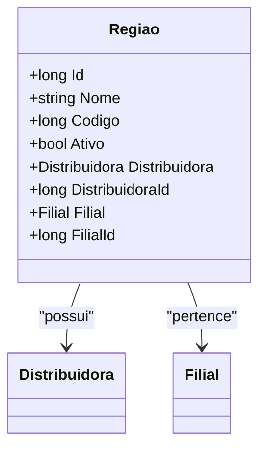

# Regiao

**Namespace**: IsthmusWinthor.Dominio.Entidades  
**Nome do Arquivo**: Regiao.cs  

## Visão Geral e Responsabilidade
A classe `Regiao` representa uma região associada a uma filial e uma distribuidora no sistema. Ela é fundamental para a organização geográfica e operacional dentro da aplicação, permitindo que as operações comerciais sejam realizadas em regiões específicas. Sua função principal é gerenciar a relação entre os dados da região, garantindo que cada região esteja devidamente vinculada a uma filial e uma distribuidora.

## Métodos de Negócio

### Título: `Equals` (override)
- **Objetivo**: Garante que a comparação entre duas instâncias de `Regiao` considere apenas os atributos que definem a identidade da região, que são `Codigo` e `DistribuidoraId`.
- **Comportamento**: 
  1. Recebe um objeto como parâmetro e verifica se ele é do tipo `Regiao`.
  2. Compara o `Codigo` e `DistribuidoraId` do objeto atual com os valores do objeto recebido.
  3. Retorna `true` se ambos os atributos forem iguais, indicando que as regiões são consideradas iguais; caso contrário, retorna `false`.
- **Retorno**: Um valor booleano que indica se as duas instâncias de `Regiao` são equivalentes.

### Título: `GetHashCode` (override)
- **Objetivo**: Garante que o cálculo do código hash de uma instância de `Regiao` considera os atributos que definem sua identidade, que são `Codigo` e `DistribuidoraId`, permitindo o uso correto da classe em coleções que utilizam hashing.
- **Comportamento**: 
  1. Utiliza `HashCode.Combine` para combinar os valores de `Codigo` e `DistribuidoraId`.
  2. Retorna o valor do código hash resultante.
- **Retorno**: Um inteiro representando o código hash da instância de `Regiao`.

## Propriedades Calculadas e de Validação
- **Propriedades**: Não há propriedades com lógica no `get` ou validação no `set` identificadas nesta classe.

## Navigations Property
- `[Distribuidora](Distribuidora.md)`
- `[Filial](Filial.md)`

## Tipos Auxiliares e Dependências
- Nenhum enumerador ou classe estática/helper utilizada nesta classe.

## Diagrama de Relacionamentos

