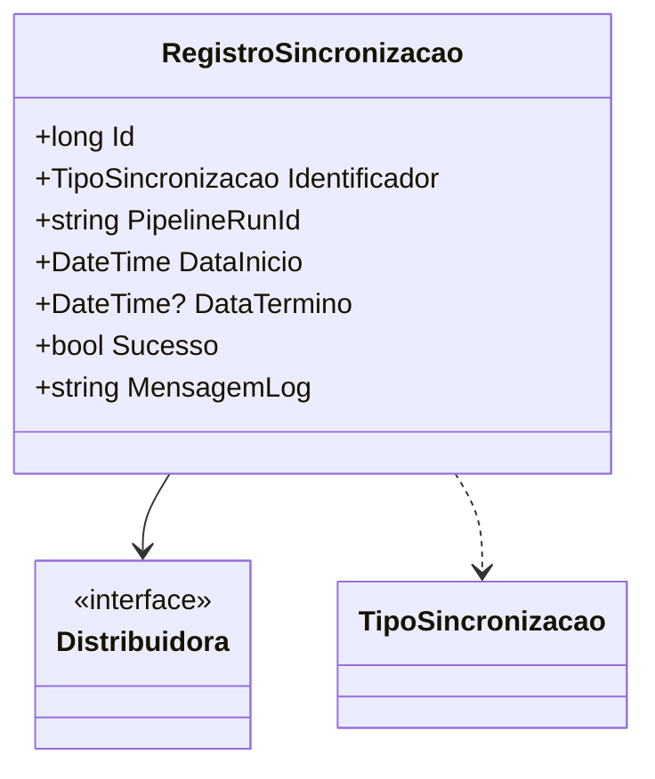

# RegistroSincronizacao
**Namespace**: IsthmusWinthor.Dominio.Entidades  
**Nome do Arquivo**: RegistroSincronizacao.cs  

## Visão Geral e Responsabilidade
A classe `RegistroSincronizacao` é um Rich Domain Model que registra informações sobre o processo de sincronização de fotos. Ela é responsável por manter o histórico de sincronizações, capturando detalhes como o estado da operação (sucesso ou falha), tempos de início e término, além de mensagens de log que podem ser úteis para auditoria e diagnóstico de problemas. Este modelo permite que a aplicação monitore e gerencie as operações de sincronização eficazmente.

## Métodos de Negócio
Não há métodos com lógica de negócios implementados nesta classe. Todas as propriedades descritas são simples e não contêm lógica complexa.

## Propriedades Calculadas e de Validação
As propriedades da classe `RegistroSincronizacao` não contêm lógica com validações ou cálculos em seus getters ou setters. Todas as propriedades são anêmicas, apenas mantendo o estado.

## Navigations Property
- `Distribuidora`: [Distribuidora](Distribuidora.md)

## Tipos Auxiliares e Dependências
- `TipoSincronizacao`: [TipoSincronizacao](TipoSincronizacao.md)

## Diagrama de Relacionamentos

---
Gerada em 29/12/2025 20:46:42
