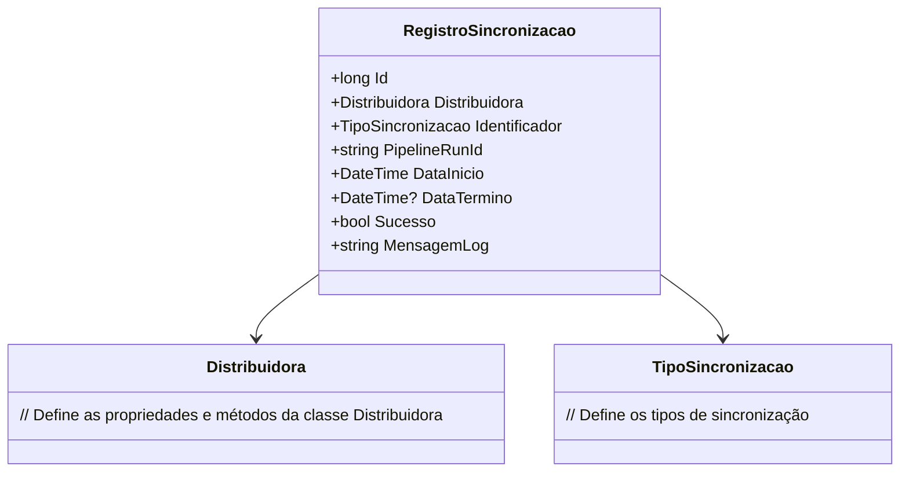

# RegistroSincronizacao
**Namespace**: IsthmusWinthor.Dominio.Entidades  
**Nome do Arquivo**: RegistroSincronizacao.cs  

## Visão Geral e Responsabilidade
A classe `RegistroSincronizacao` atua como um modelo de domínio responsável pelo gerenciamento do estado e informações relativas à sincronização de fotos em um sistema. Seu propósito é registrar detalhes sobre cada operação de sincronização, permitindo rastreamento e auditoria dos processos de integração de dados de imagens, o que é fundamental para garantir a integridade e sucesso dessas operações.

## Métodos de Negócio
A classe `RegistroSincronizacao` não possui métodos de negócio com lógica complexa atrelados a regras específicas, portanto, não há métodos detalhados a serem descritos.

## Propriedades Calculadas e de Validação
A classe contém propriedades aninhadas simples e não tem propriedades que implementem lógica de cálculo em seus getters ou validações em seus setters.

## Navigations Property
- `[Distribuidora](Distribuidora.md)`: Representa a distribuidora associada ao registro de sincronização, permitindo a ligação entre as informações de sincronização e a entidade distribuidora.

## Tipos Auxiliares e Dependências
- `[TipoSincronizacao](TipoSincronizacao.md)`: Enum que define os diferentes tipos de sincronização possíveis, utilizados para categorizar cada registro de sincronização.

## Diagrama de Relacionamentos

Esta documentação foi elaborada para fornecer clareza sobre o propósito e a estrutura da classe `RegistroSincronizacao`, visando facilitar o entendimento das regras de negócio e a integridade de dados em relação à sincronização de fotos no sistema.
