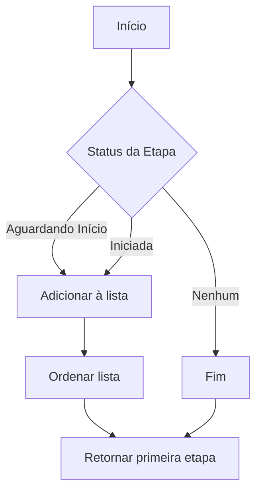
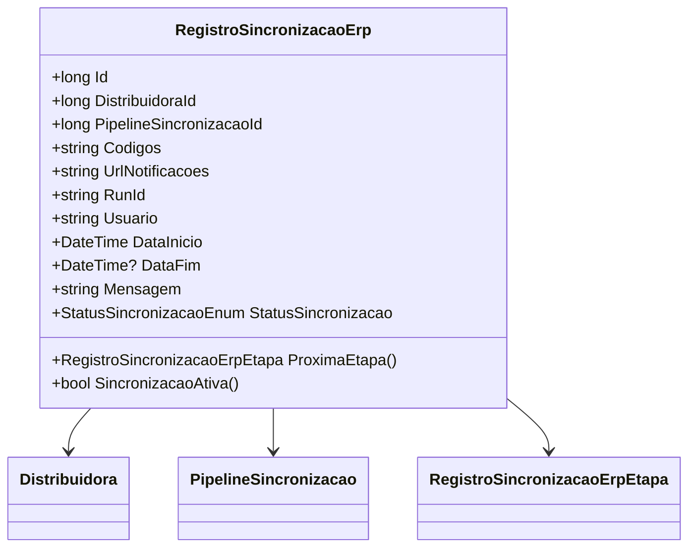

# RegistroSincronizacaoErp
**Namespace**: IsthmusWinthor.Dominio.Entidades  
**Nome do Arquivo**: RegistroSincronizacaoErp.cs

## Visão Geral e Responsabilidade
A classe `RegistroSincronizacaoErp` representa uma entidade que gerencia o registro de sincronizações entre um sistema ERP e outros sistemas corporativos. Seu papel é garantir que as etapas do processo de sincronização sejam controladas e monitoradas, permitindo uma gestão efetiva do fluxo de dados e a recuperação de informações sobre o status e progresso das sincronizações. Essa classe é crítica para assegurar a integridade dos dados durante a transferência e para gerenciar o estado das operações, contribuindo assim para a robustez do sistema como um todo.

## Métodos de Negócio

### ProximaEtapa
- **Objetivo**: Garante que a próxima etapa da sincronização seja disponibilizada, conforme seu status.
- **Comportamento**: 
  1. Filtra as etapas de sincronização (`RegistroSincronizacaoErpEtapas`) para encontrar aquelas que estão aguardando início ou que já foram iniciadas.
  2. Ordena as etapas disponíveis pela propriedade `Ordem`.
  3. Retorna a primeira etapa da lista filtrada, caso exista.
- **Retorno**: Retorna um objeto `RegistroSincronizacaoErpEtapa` que representa a próxima etapa a ser realizada, ou `null` se não houver etapas disponíveis.

### SincronizacaoAtiva
- **Objetivo**: Determina se a sincronização está atualmente ativa.
- **Comportamento**: Compara o estado atual da propriedade `StatusSincronizacao` com os estados específicos que indicam que a sincronização está aguardando início ou que já foi iniciada.
- **Retorno**: Retorna um valor booleano; `true` se a sincronização estiver ativa e `false` caso contrário.

## Propriedades Calculadas e de Validação
Nenhuma propriedade foi identificada com lógica no `get` ou validação no `set` nesta classe.

## Navigations Property
- [Distribuidora](Distribuidora.md)
- [PipelineSincronizacao](PipelineSincronizacao.md)
- [RegistroSincronizacaoErpEtapa](RegistroSincronizacaoErpEtapa.md)

## Tipos Auxiliares e Dependências
- [StatusSincronizacaoEnum](StatusSincronizacaoEnum.md)

## Diagrama de Relacionamentos

