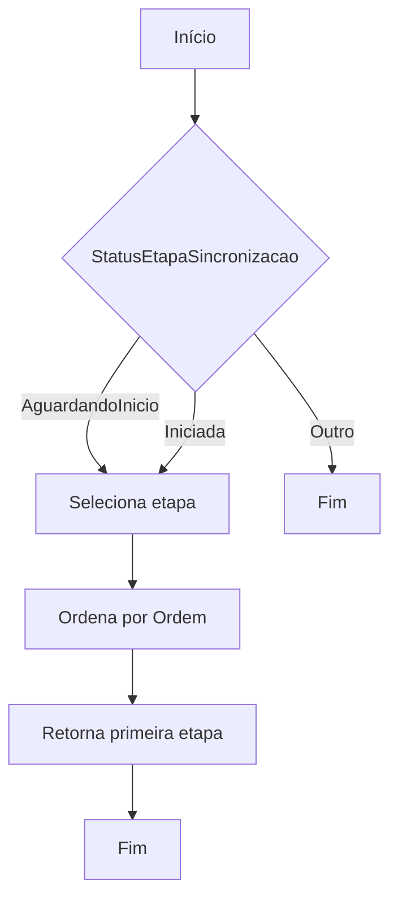
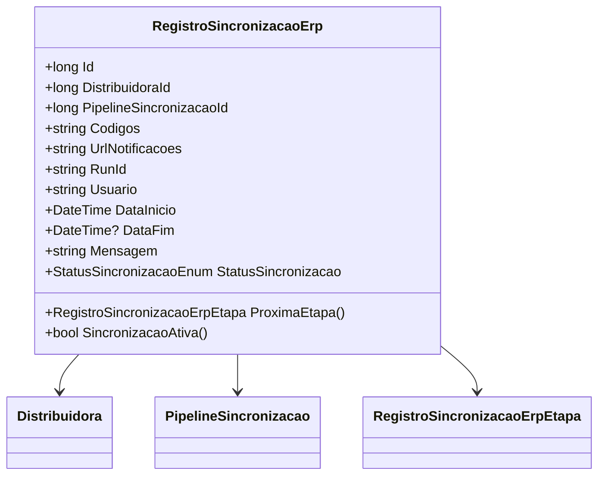

# RegistroSincronizacaoErp
**Namespace**: IsthmusWinthor.Dominio.Entidades  
**Nome do Arquivo**: RegistroSincronizacaoErp.cs  

## Visão Geral e Responsabilidade
A classe `RegistroSincronizacaoErp` representa uma entidade que gerencia o registro de sincronizações entre um ERP (Enterprise Resource Planning) e o sistema. O principal objetivo dessa classe é ajudar a rastrear e controlar o progresso das sincronizações, possibilitando verificações de estado e gerenciamento de etapas do processo de sincronização, abordando assim a necessidade de monitoramento e controle no fluxo das integrações.

## Métodos de Negócio

### ProximaEtapa() - Visibilidade: public
- **Objetivo**: Garante a obtenção da próxima etapa disponível que está aguardando para ser iniciada ou já foi iniciada, proporcionando um fluxo contínuo na operação de sincronização.
- **Comportamento**:
  1. Filtra as etapas de sincronização associadas ao registro que estão com status `AguardandoInicio` ou `Iniciada`.
  2. Ordena essas etapas com base na propriedade `Ordem`.
  3. Retorna a primeira etapa da lista filtrada, que representa a próxima etapa pronta para execução.
- **Retorno**: Retorna uma instância de `RegistroSincronizacaoErpEtapa` que representa a próxima etapa disponível ou `null` se não houver nenhuma etapa disponível.

### SincronizacaoAtiva() - Visibilidade: public
- **Objetivo**: Determina se a sincronização está atualmente ativa, verificando o status da sincronização do registro.
- **Comportamento**: Compara o status da sincronização com os estados `AguardandoInicio` e `Iniciada`. Se o status do registro corresponder a um desses estados, considera a sincronização como ativa.
- **Retorno**: Retorna um valor booleano que indica se a sincronização está ativa (`true`) ou não (`false`).

## Propriedades Calculadas e de Validação
Não há propriedades com lógica no `get` ou validação no `set` a serem documentadas.

## Navigations Property
- [Distribuidora](Distribuidora.md)
- [PipelineSincronizacao](PipelineSincronizacao.md)
- [RegistroSincronizacaoErpEtapa](RegistroSincronizacaoErpEtapa.md)

## Tipos Auxiliares e Dependências
- [StatusSincronizacaoEnum](StatusSincronizacaoEnum.md)

## Diagrama de Relacionamentos

---
Gerada em 29/12/2025 20:46:58
