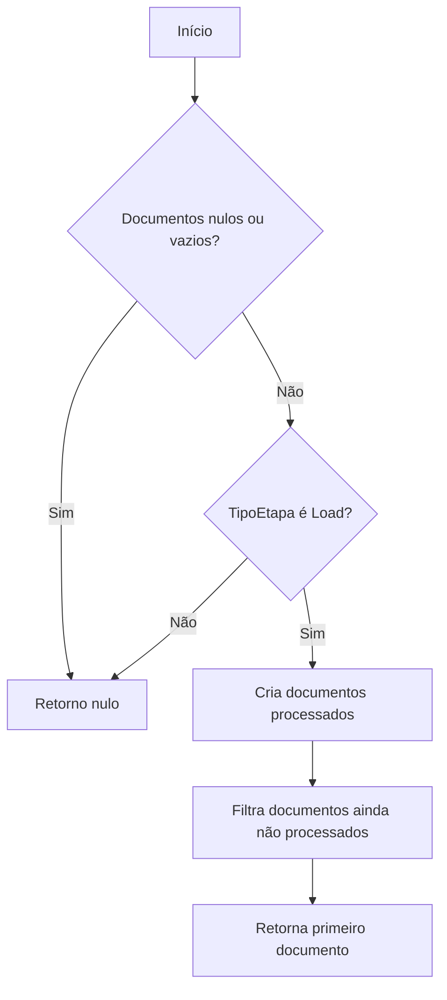
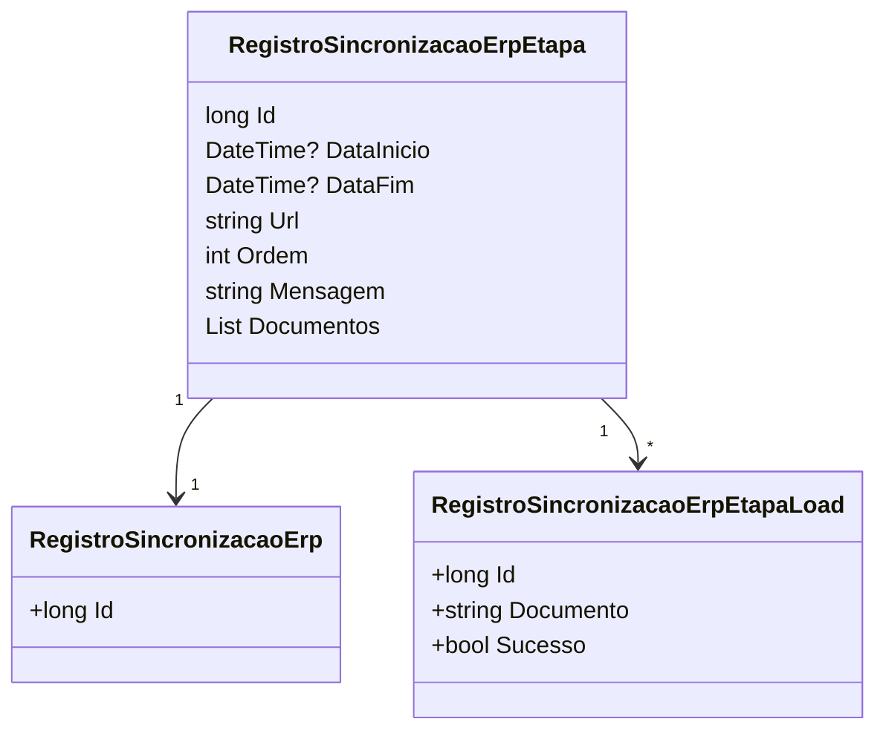

# RegistroSincronizacaoErpEtapa
**Namespace**: IsthmusWinthor.Dominio.Entidades  
**Nome do Arquivo**: RegistroSincronizacaoErpEtapa.cs  

## Visão Geral e Responsabilidade
A classe `RegistroSincronizacaoErpEtapa` é responsável por gerenciar os registros de sincronização de etapas em um sistema de integração com um ERP. Ela estabelece a lógica para controlar o status e o progresso de cada etapa de sincronização, permitindo determinar se as operações foram realizadas com sucesso e gerenciar a lista de documentos a serem processados durante a sincronização. O problema de negócio que ela resolve é tornar o processo de sincronização mais eficiente e rastreável.

## Métodos de Negócio

### UrlRequisicao (public)
- **Objetivo**: Garante que uma URL de requisição válida seja gerada a partir de uma URL base.
- **Comportamento**:
  1. Verifica se a `urlBase` é nula ou vazia e lança uma exceção se for.
  2. Remove a barra final da `urlBase`, se existir.
  3. Remove a barra inicial da propriedade `Url`, se existir.
  4. Combina `urlServidor` e `urlRequest` para formar a URL final para a requisição.
- **Retorno**: Retorna a URL formatada.

### ProximoDocumento (public)
- **Objetivo**: Garante que o próximo documento a ser processado em uma etapa de Load seja retornado.
- **Comportamento**:
  1. Verifica se a lista de `Documentos` está vazia ou se a `TipoEtapa` não é 'Load'. Se qualquer uma dessas condições for verdadeira, retorna nulo.
  2. Cria uma lista de documentos que já foram processados por meio das `RegistroSincronizacaoErpEtapaLoads`.
  3. Filtra os documentos que ainda não foram processados e retorna o primeiro documento da lista filtrada.
- **Retorno**: Retorna o próximo documento a ser processado ou nulo.

### Propriedades Calculadas e de Validação

#### Sucesso (bool)
- **Regra**: Determina se a etapa de sincronização foi completada com sucesso. Considera-se bem-sucedida se o `StatusEtapaSincronizacao` for 'Finalizada' e se todos os loads da etapa foram executados com sucesso.

#### LoadsExecutados (bool)
- **Regra**: Indica se todas as etapas de Load foram executadas corretamente. Para etapas que não são do tipo Load, retorna verdadeiro automaticamente. Para as etapas de Load, verifica se não há documentos restantes a serem processados e se todos os registros da etapa de Load tiveram sucesso.

## Navigations Property
- [RegistroSincronizacaoErp](RegistroSincronizacaoErp.md)
- [RegistroSincronizacaoErpEtapaLoad](RegistroSincronizacaoErpEtapaLoad.md)

## Tipos Auxiliares e Dependências
- [TipoSincronizacao](TipoSincronizacao.md)
- [TipoEtapaSincronizacaoEnum](TipoEtapaSincronizacaoEnum.md)
- [StatusSincronizacaoEnum](StatusSincronizacaoEnum.md)

## Diagrama de Relacionamentos

