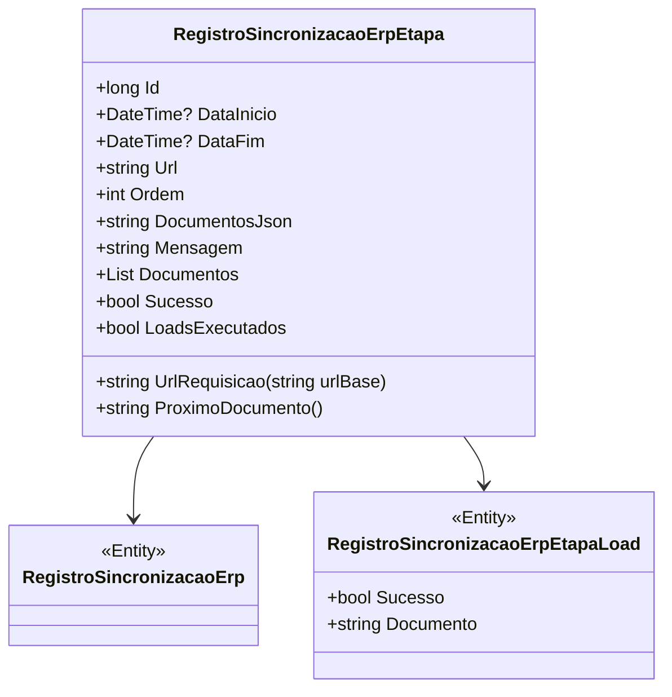

# RegistroSincronizacaoErpEtapa
**Namespace**: IsthmusWinthor.Dominio.Entidades  
**Nome do Arquivo**: RegistroSincronizacaoErpEtapa.cs  

## Visão Geral e Responsabilidade
A classe `RegistroSincronizacaoErpEtapa` atua como uma representação de uma etapa de sincronização entre um sistema ERP e outra entidade de dados. Ela gerencia o ciclo de vida da sincronização, incluindo a inicialização, o processamento e a conclusão das etapas. Esta classe é fundamental para garantir que a sincronização ocorra de forma ordenada e que todas as etapas sejam monitoradas com precisão, buscando resolver problemas de integridade e rastreabilidade dos dados durante processos de integração.

## Métodos de Negócio

### UrlRequisicao
- **Visibilidade**: `public`
- **Objetivo**: Garante que a URL gerada para o servidor esteja no formato correto.
- **Comportamento**:
  1. Verifica se a `urlBase` está vazia ou nula, lançando uma exceção caso afirmativo.
  2. Remove a barra final da `urlBase`, se existir.
  3. Remove a barra inicial da `Url`, se existir.
  4. Retorna a URL formatada concatenando a `urlBase` e a `Url`.
- **Retorno**: Retorna uma string representando a URL requisição formatada para o servidor.

### ProximoDocumento
- **Visibilidade**: `public`
- **Objetivo**: Determina qual é o próximo documento a ser processado na etapa de sincronização.
- **Comportamento**:
  1. Verifica se a lista de `Documentos` é nula ou está vazia, ou se a `TipoEtapa` não é do tipo `Load`. Se sim, retorna `null`.
  2. Coleta os documentos que já foram processados através da lista `RegistroSincronizacaoErpEtapaLoads`.
  3. Filtra a lista de `Documentos` para excluir aqueles que já foram processados.
  4. Retorna o primeiro documento da lista filtrada ou `null` se não houver documentos restantes.
- **Retorno**: Retorna uma string representando o próximo documento a ser processado ou `null`.

## Propriedades Calculadas e de Validação

### Sucesso
- **Nota**: Esta propriedade retorna `true` se a etapa foi finalizada com sucesso.
- **Regra**: Considera que a etapa foi concluída com sucesso quando o `StatusEtapaSincronizacao` é igual a `Finalizada` e se todos os documentos na etapa de `Load` foram processados com sucesso.

### LoadsExecutados
- **Nota**: Esta propriedade informa se todos os loads foram executados com sucesso.
- **Regra**: Retorna `true` se a etapa atual não é um tipo de load ou se não há próximo documento a ser processado e todos os loads foram marcados como bem-sucedidos.

## Navigations Property
- [RegistroSincronizacaoErp](RegistroSincronizacaoErp.md) 
- [RegistroSincronizacaoErpEtapaLoad](RegistroSincronizacaoErpEtapaLoad.md)

## Tipos Auxiliares e Dependências
- [TipoSincronizacao](TipoSincronizacao.md) 
- [TipoEtapaSincronizacaoEnum](TipoEtapaSincronizacaoEnum.md) 
- [StatusSincronizacaoEnum](StatusSincronizacaoEnum.md) 

## Diagrama de Relacionamentos

---
Gerada em 29/12/2025 20:47:20
