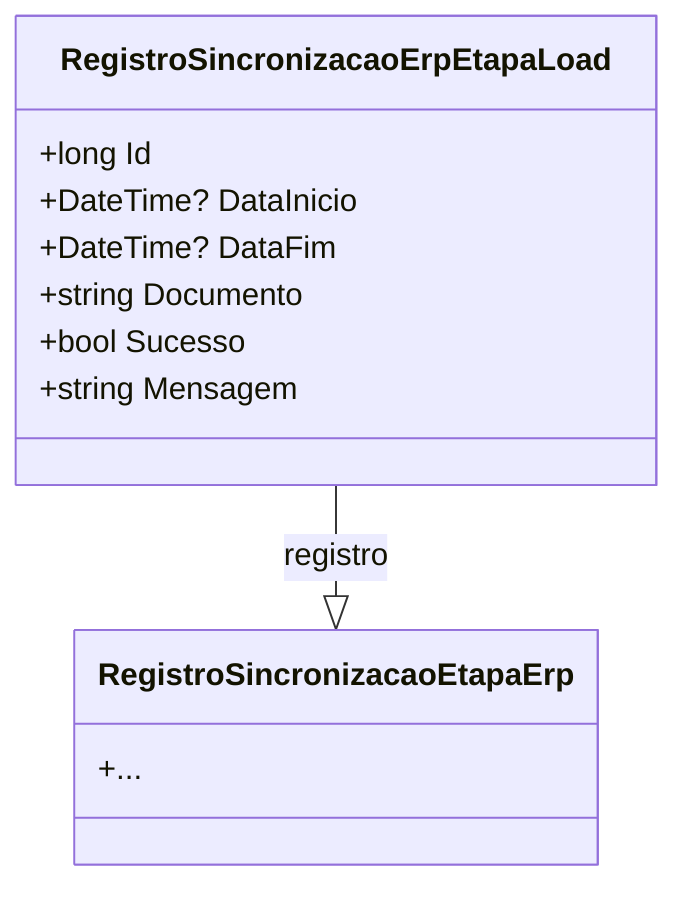

# RegistroSincronizacaoErpEtapaLoad
**Namespace**: IsthmusWinthor.Dominio.Entidades  
**Nome do Arquivo**: RegistroSincronizacaoErpEtapaLoad.cs  

## Visão Geral e Responsabilidade
A classe `RegistroSincronizacaoErpEtapaLoad` representa um registro detalhado para cada etapa de load realizada durante o processo de sincronização com o ERP (Enterprise Resource Planning). Sua principal responsabilidade é armazenar informações sobre cada load, incluindo tempos de início e fim, estado de sucesso, e mensagens relevantes. Essa classe auxilia na auditoria e monitoramento das etapas de sincronização, garantindo que os processos sejam rastreados e que possíveis falhas sejam devidamente registradas.

## Métodos de Negócio
- **Título**: [Não há métodos de negócio complexos nesta classe]
  
## Propriedades Calculadas e de Validação
- **DataInicio**: Pode ser null, representando que a etapa de load ainda não começou. Caso contrário, armazena o momento em que o load foi iniciado.
- **DataFim**: Também pode ser null, indicativo de que o load não foi concluído. Se Populada, mostra quando a etapa foi finalizada.
  
## Navigations Property
- `[RegistroSincronizacaoEtapaErp](RegistroSincronizacaoEtapaErp.md)`: Representa uma classe associada que contém informações sobre a etapa geral de sincronização do ERP à qual este load pertence.

## Tipos Auxiliares e Dependências
Não há enumeradores ou classes auxiliares diretamente associadas a essa classe.

## Diagrama de Relacionamentos

