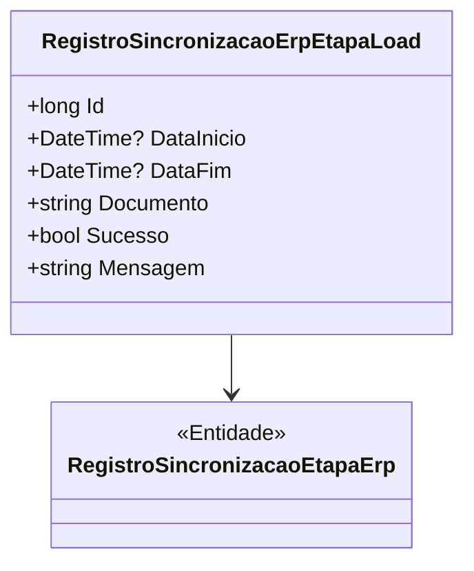

# RegistroSincronizacaoErpEtapaLoad
**Namespace**: IsthmusWinthor.Dominio.Entidades  
**Nome do Arquivo**: RegistroSincronizacaoErpEtapaLoad.cs  

## Visão Geral e Responsabilidade
A classe `RegistroSincronizacaoErpEtapaLoad` é um modelo de domínio que representa um registro de cada etapa de carga (load) realizada durante um processo de sincronização de dados entre sistemas ERP (Enterprise Resource Planning). Essa classe é essencial para rastrear e documentar o sucesso ou falha de operações de carga, bem como para registrar as informações relevantes sobre cada tentativa de carga, permitindo a recuperação e análise de dados históricos em operações de integração de sistemas.

## Métodos de Negócio
(No código fornecido não foram encontrados métodos com lógica. A classe se compõe principalmente de propriedades e não contém lógica de negócio no formato requerido.)

## Propriedades Calculadas e de Validação
- **DataInicio**: Esta propriedade deve ser validada para garantir que um registro de início de carga só seja criado se a data de início for anterior a `DataFim`.
- **DataFim**: Esta propriedade deve validar que a data de fim não pode ser anterior à data de início. Essa validação garante a integridade dos dados registrados, assegurando que a sequência de operações temporais é lógica.

## Navigations Property
- [`RegistroSincronizacaoEtapaErp`](RegistroSincronizacaoEtapaErp.md): Esta propriedade representa a associação com outra classe do domínio, que contém informações sobre a etapa de sincronização relacionada.

## Tipos Auxiliares e Dependências
- Não há enumeradores ou classes auxiliares visíveis no código fornecido. Caso existam, deverão ser documentadas aqui.

## Diagrama de Relacionamentos

---
Gerada em 29/12/2025 20:47:29
