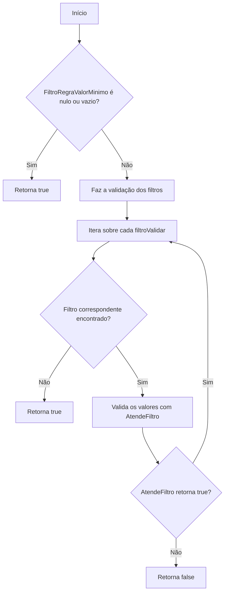
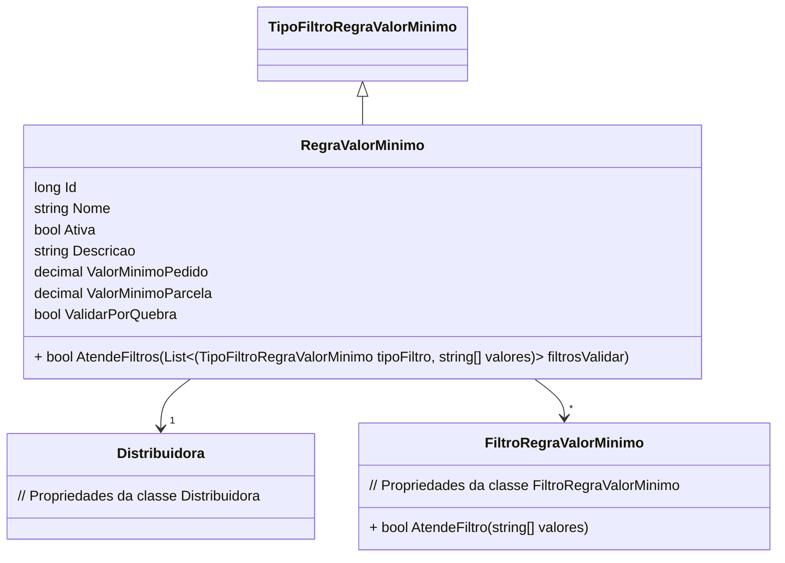

# RegraValorMinimo
**Namespace**: IsthmusWinthor.Dominio.Entidades  
**Nome do Arquivo**: RegraValorMinimo.cs

## Visão Geral e Responsabilidade
A classe `RegraValorMinimo` representa uma entidade no contexto do sistema que gerencia regras de negócio relacionadas ao valor mínimo para pedidos e parcelas. Seu papel é assegurar que certas condições (filtros) sejam atendidas em relação a essas regras ao validar as operações que dependem das informações de valor da distribuidora. Isso garante a consistência nas transações econômicas e nas obrigações contratuais.

## Métodos de Negócio

### Título: `AtendeFiltros` (public)
- **Objetivo**: Garante que todos os filtros necessários sejam validados em relação à regra de valor mínimo associada.
- **Comportamento**:
  1. Verifica se a coleção de `FiltroRegraValorMinimo` está nula ou vazia. Se sim, retorna `true` imediatamente, indicando que não há filtros a serem validados.
  2. Para cada filtro fornecido na lista `filtrosValidar`, tenta encontrar um filtro correspondente na coleção da regra.
  3. Se não for encontrado um filtro correspondente para um tipo de filtro validado, considera esse filtro como aceito (`true`).
  4. Se um filtro correspondente é encontrado, chama o método `AtendeFiltro` do filtro da regra para validar os valores fornecidos.
  5. Se todos os filtros forem validados com sucesso, retorna `true`; caso contrário, retorna `false`.
- **Retorno**: Retorna um valor booleano que indica se todos os filtros da regra são atendidos de acordo com os filtros informados.

## Propriedades Calculadas e de Validação
- **ValorMinimoPedido**: Representa o valor mínimo requerido para um pedido. Deve ser maior que zero.
- **ValorMinimoParcela**: Representa o valor mínimo requerido para cada parcela de um pedido. Também deve ser maior que zero.

## Navigation Property
- `[Distribuidora](Distribuidora.md)`: Representa a distribuidora associada à regra de valor mínimo. Essa propriedade conecta a `RegraValorMinimo` a uma entidade que contém informações relevantes sobre a distribuidora.

- `[FiltroRegraValorMinimo](FiltroRegraValorMinimo.md)`: Representa os filtros que podem ser aplicados às regras de valor mínimo, permitindo a personalização das regras de acordo com critérios específicos.

## Tipos Auxiliares e Dependências
- `[TipoFiltroRegraValorMinimo](TipoFiltroRegraValorMinimo.md)`: Enum que representa os tipos de filtros disponíveis que podem ser utilizados nas regras.

## Diagrama de Relacionamentos

