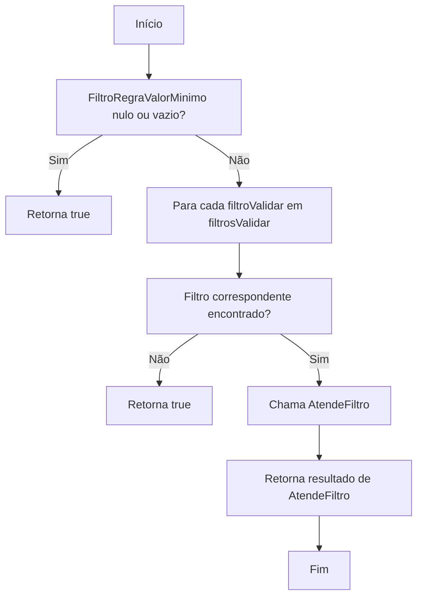
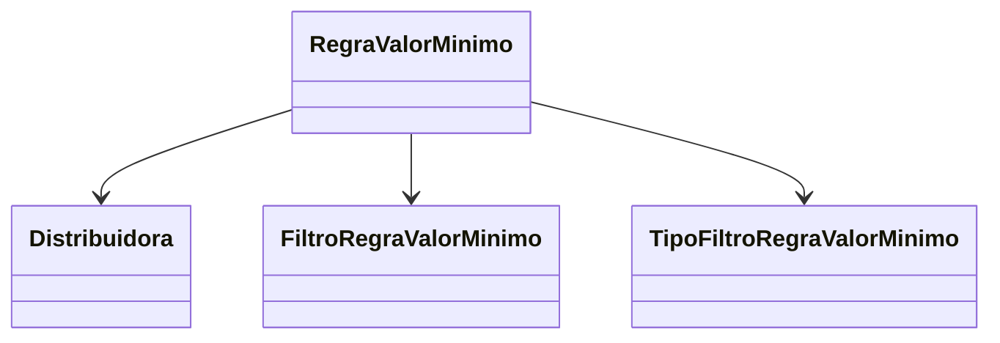

# RegraValorMinimo
**Namespace**: IsthmusWinthor.Dominio.Entidades  
**Nome do Arquivo**: RegraValorMinimo.cs

## Visão Geral e Responsabilidade
A classe `RegraValorMinimo` é responsável por gerenciar as regras de negócio relativas ao valor mínimo de pedidos e parcelas em um sistema financeiro. Ela garante que certas condições sejam atendidas com base em filtros definidos, o que é fundamental para o controle de transações e conformidade com as políticas da distribuidora.

## Métodos de Negócio

### 1. AtendeFiltros - Visibilidade: public
- **Objetivo**: Este método assegura que a regra de valor mínimo atenda a todos os filtros fornecidos. Ele valida se os filtros definidos para a regra são compatíveis com os critérios apresentados.
- **Comportamento**: 
  1. Primeiro, verifica se `FiltroRegraValorMinimo` está vazio ou nulo; nesse caso, a regra é considerada válida, pois não há restrições.
  2. Em seguida, percorre todos os filtros que precisam ser validados.
  3. Para cada filtro, procura um filtro correspondente na regra. Se não houver um filtro correspondente na regra, esse filtro é considerado sempre válido.
  4. Se houver um filtro correspondente, a função `AtendeFiltro` desse filtro é chamada com os valores do filtro a ser validado.
- **Retorno**: Retorna `true` se todos os filtros são atendidos, caso contrário, retorna `false`.

## Propriedades Calculadas e de Validação
- **ValorMinimoPedido**: Propriedade que define o valor mínimo permitido para um pedido, essencial para a conformidade com as regras financeiras.
- **ValorMinimoParcela**: Propriedade que determina o valor mínimo para cada parcela, usada para controle financeiro em pagamentos parcelados.

## Navigations Property
- [Distribuidora](Distribuidora.md): A classe que representa a distribuidora relacionada a esta regra de valor mínimo.
- [FiltroRegraValorMinimo](FiltroRegraValorMinimo.md): Coleção que contém os filtros associados a esta regra de valor mínimo.

## Tipos Auxiliares e Dependências
- [TipoFiltroRegraValorMinimo](TipoFiltroRegraValorMinimo.md): Enumerador que define os tipos de filtros que podem ser aplicados a esta regra.

## Diagrama de Relacionamentos

---
Gerada em 29/12/2025 20:47:43
