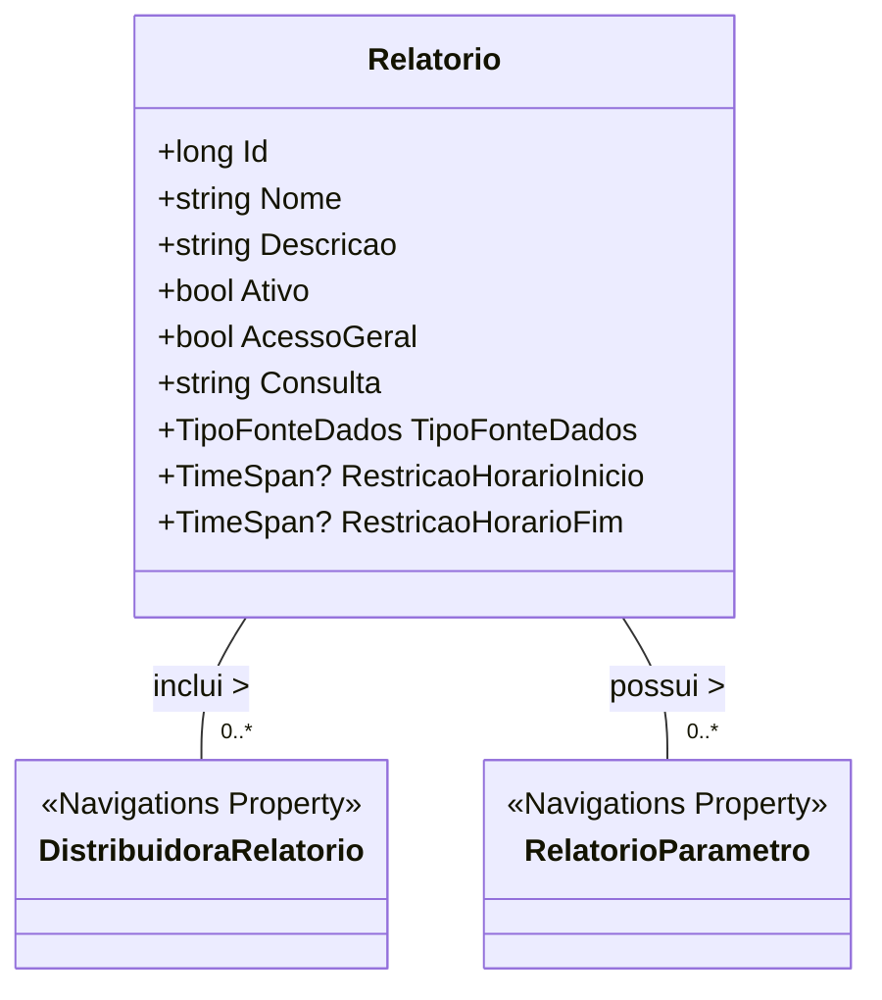

# Relatorio

**Namespace**: IsthmusWinthor.Dominio.Entidades  
**Nome do Arquivo**: Relatorio.cs  

## Visão Geral e Responsabilidade
A classe `Relatorio` representa um modelo de domínio que encapsula os dados e comportamentos relacionados à geração de relatórios em um sistema. Ela é responsável por definir as características de um relatório, incluindo seu nome, descrição, status de atividade (ativo/inativo), acessibilidade geral, consulta de dados e a fonte de dados utilizada. A classe resolve o problema de gerenciamento e execução de relatórios, garantindo que apenas relatórios válidos e autorizados sejam acessados e utilizados pelas distribuidoras pertinentes.

## Métodos de Negócio
Atualmente, a classe não possui métodos de negócio com lógica complexa, portanto, não há métodos a serem detalhados neste momento.

## Propriedades Calculadas e de Validação
Atualmente, não existem propriedades na classe `Relatorio` com lógica no `get` ou validação no `set`.

## Navigations Property
- `DistribuidorasPermitidas`: [DistribuidoraRelatorio](DistribuidoraRelatorio.md)  
- `RelatorioParametros`: [RelatorioParametro](RelatorioParametro.md)  

## Tipos Auxiliares e Dependências
- [TipoFonteDados](TipoFonteDados.md)

## Diagrama de Relacionamentos

Essa documentação deve proporcionar uma visão clara da classe `Relatorio` e suas responsabilidades, além de definir suas dependências e relacionamento com outras entidades do domínio.
---
Gerada em 29/12/2025 20:47:54
