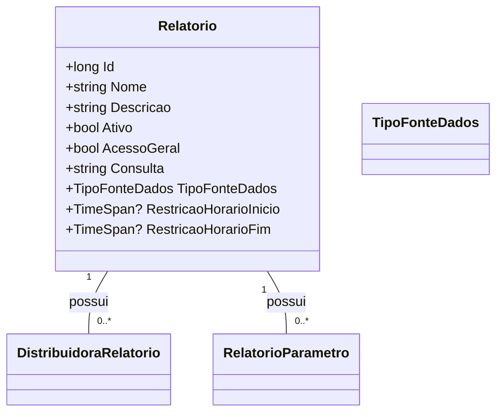

# Relatorio
**Namespace**: IsthmusWinthor.Dominio.Entidades  
**Nome do Arquivo**: Relatorio.cs  

## Visão Geral e Responsabilidade
A classe `Relatorio` atua como uma representação de um relatório dentro do sistema, encapsulando as definições essenciais que determinam como um relatório é configurado e acessado. Ela resolve a necessidade de gerir relatórios dinâmicos, permitindo a configuração de parâmetros, restrições e definições de acesso, essenciais para a execução e análise de dados.

## Métodos de Negócio
### (Não há métodos com lógica complexa, apenas um construtor e métodos simples de acesso.)

## Propriedades Calculadas e de Validação
### Atributos Privados:
- `Ativo`: Indica se o relatório está ativo ou não.
- `AcessoGeral`: Indica se o relatório pode ser acessado por um amplo público.
  
Essas propriedades precisam ser validadas em qualquer operação que envolva a apresentação ou execução de um relatório.

## Navigation Properties
- `[DistribuidoraRelatorio](DistribuidoraRelatorio.md)`: Lista de distribuidoras permitidas para acessar o relatório.
- `[RelatorioParametro](RelatorioParametro.md)`: Lista de parâmetros associados ao relatório.

## Tipos Auxiliares e Dependências
- `[TipoFonteDados](TipoFonteDados.md)`: Enumerador que define os tipos de fonte de dados que o relatório pode utilizar.
- `[DistribuidoraRelatorio](DistribuidoraRelatorio.md)`: Classe que representa a distribuição de relatórios permitidos.
- `[RelatorioParametro](RelatorioParametro.md)`: Classe que representa os parâmetros do relatório.

## Diagrama de Relacionamentos

Esta documentação fornece uma compreensão clara do `Relatorio` como uma parte crítica do domínio do sistema, detalhando suas regras de negócios, propriedades importantes e suas interações com outras entidades.
