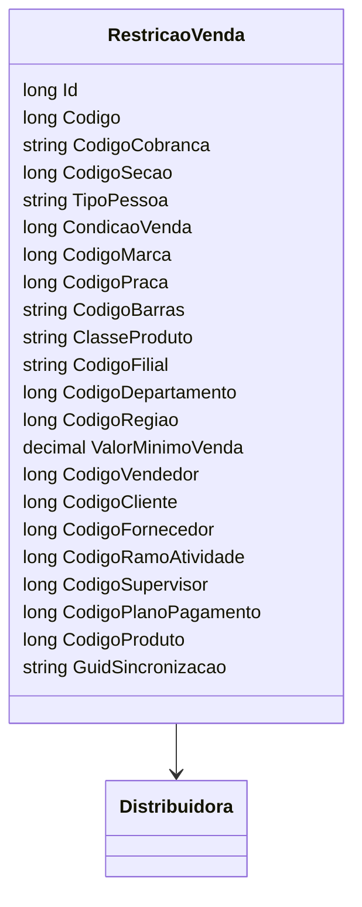

# RestricaoVenda
**Namespace**: IsthmusWinthor.Dominio.Entidades  
**Nome do Arquivo**: RestricaoVenda.cs  

## Visão Geral e Responsabilidade
A classe `RestricaoVenda` é responsável por gerenciar as restrições aplicáveis às vendas em um sistema corporativo, permitindo a definição de condições que influenciam a viabilidade da venda de produtos. Essa lógica é vital para assegurar que as vendas sejam realizadas somente em conformidade com as regras e condições específicas que podem incluir fatores como marca, praça, tipo de cliente, e outros, ajudando a prevenir transações indevidas ou não autorizadas.

## Métodos de Negócio
### Método: N/A
- **Objetivo**: Não há métodos expostos com lógica de negócio na classe.
- **Comportamento**: A classe serve principalmente como um contêiner de dados (DTO) para eventualmente encapsular regras em outro processo.
- **Retorno**: N/A

## Propriedades Calculadas e de Validação
N/A

## Navigations Property
- [Distribuidora](Distribuidora.md)

## Tipos Auxiliares e Dependências
N/A

## Diagrama de Relacionamentos

Esta documentação oferece uma visão clara e organizada das funcionalidades e responsabilidades da classe `RestricaoVenda`, enfatizando sua importância dentro do contexto de Controladoria de Vendas em um sistema corporativo.
