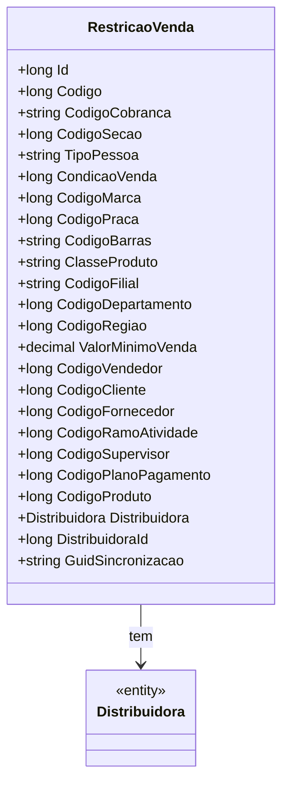

# RestricaoVenda
**Namespace**: IsthmusWinthor.Dominio.Entidades  
**Nome do Arquivo**: RestricaoVenda.cs  

## Visão Geral e Responsabilidade
A classe `RestricaoVenda` atua como uma representação das restrições que impactam as vendas em um sistema. Ela modela as diversas condições que podem afetar a capacidade de venda, como o código de cobrança, condição de venda, e valores mínimos de venda, entre outros. A necessidade desta classe surge da complexidade envolvida na gestão de diferentes regras que governam as transações comerciais, assegurando que todas as vendas sejam realizadas dentro de conformidades especificadas.

## Métodos de Negócio
Não há métodos complexos definidos nesta classe, apenas propriedades de dados.

## Propriedades Calculadas e de Validação
Não há propriedades com lógica de cálculo ou validação explicitamente definidas com lógica complexa detectada.

## Navigations Property
- [Distribuidora](Distribuidora.md) - Referência para a classe `Distribuidora`, que representa a organização responsável pela distribuição dos produtos.

## Tipos Auxiliares e Dependências
Não há enumeradores ou classes estáticas mencionadas nesta classe.

## Diagrama de Relacionamentos

---
Gerada em 29/12/2025 20:48:03
