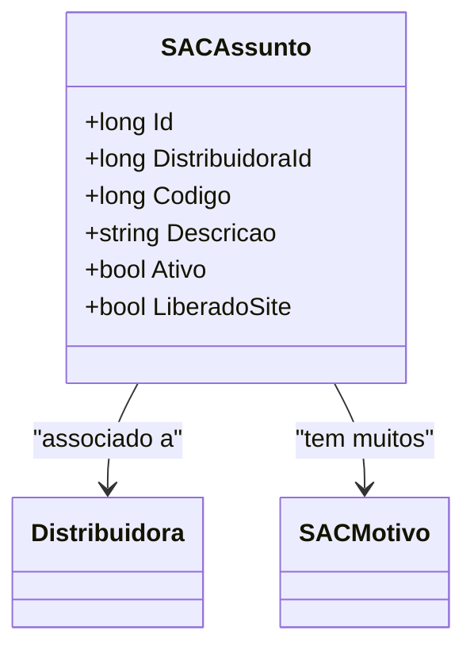

# SACAssunto
**Namespace**: IsthmusWinthor.Dominio.Entidades  
**Nome do Arquivo**: SACAssunto.cs  

## Visão Geral e Responsabilidade
A classe `SACAssunto` representa um assunto relacionado a um Sistema de Atendimento ao Cliente (SAC). Seu papel é estruturar e definir informações pertinentes a um assunto que pode ser abordado no contexto do SAC, incluindo a identificação de sua distribuidora associada, descrição, e estados de ativação. Esta classe é crucial para garantir que a comunicação do cliente seja clara e dirigida, permitindo que os assuntos sejam categorizados e gerenciados de forma eficaz.

## Métodos de Negócio
Atualmente, a classe `SACAssunto` não contém métodos com lógica de negócios complexa que exigiriam documentação. As operações sobre a classe estão focadas na manipulação direta de propriedades.

## Propriedades Calculadas e de Validação
Atualmente, a classe `SACAssunto` não contém propriedades com lógica no `get` ou validação no `set`.

## Navigations Property
- [Distribuidora](Distribuidora.md)
- [SACMotivo](SACMotivo.md)

## Tipos Auxiliares e Dependências
Nenhum tipo auxiliar ou enum utilizado diretamente nesta classe.

## Diagrama de Relacionamentos

