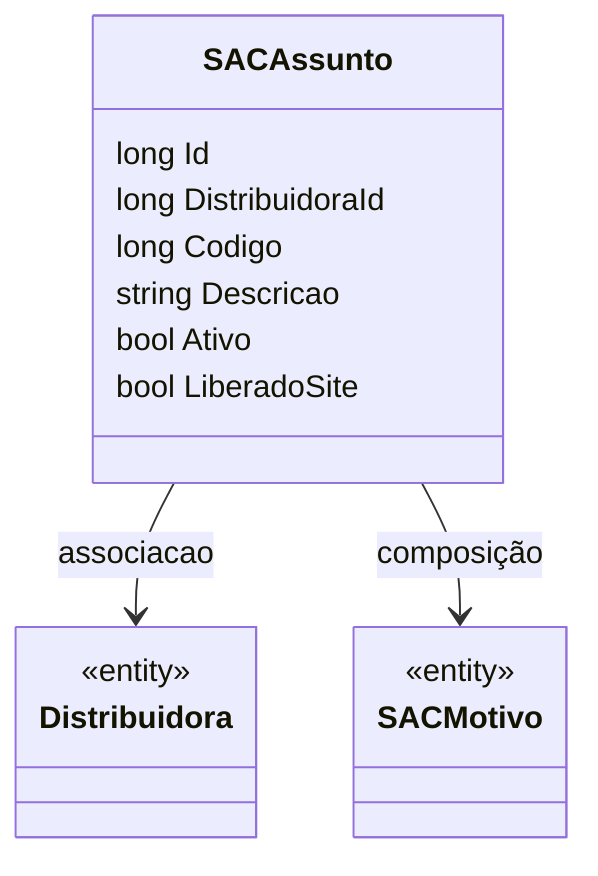

# SACAssunto

**Namespace**: IsthmusWinthor.Dominio.Entidades  
**Nome do Arquivo**: SACAssunto.cs  

## Visão Geral e Responsabilidade
A classe `SACAssunto` representa um assunto que pode ser relacionado a atendimentos no sistema de SAC (Serviço de Atendimento ao Consumidor). A sua principal responsabilidade é encapsular informações pertinentes a um assunto, como uma descrição e estado de atividade, que são fundamentais para categorizar e gerenciar as interações com os clientes. Esse modelo permite que a empresa identifique tópicos relevantes para os atendimentos, facilitando a organização e priorização das demandas.

## Métodos de Negócio
Atualmente, a classe `SACAssunto` não contém métodos de negócio com lógica complexa, concentrando-se em armazenar e gerenciar os dados por meio de suas propriedades.

## Propriedades Calculadas e de Validação
### Propriedades com Lógica
- `Ativo`: Indica se o assunto está ativo ou não, considerando regras de negócio para habilitação em atendimentos.
- `LiberadoSite`: Refere-se à visibilidade do assunto no site, que pode estar sujeito a validações de disponibilidade para os clientes.

## Navigation Property
- [Distribuidora](Distribuidora.md): Representa a distribuidora associada ao assunto, essencial para o contexto do atendimento.
- [SACMotivo](SACMotivo.md): Coleção de motivos disponíveis para o assunto, que fornece categorias adicionais para fins de classificação durante o atendimento.

## Tipos Auxiliares e Dependências
- **Enums**: Não possui enums associados atualmente.
- **Classes**:
  - [Distribuidora](Distribuidora.md)
  - [SACMotivo](SACMotivo.md)

## Diagrama de Relacionamentos

---
Gerada em 29/12/2025 20:48:12
