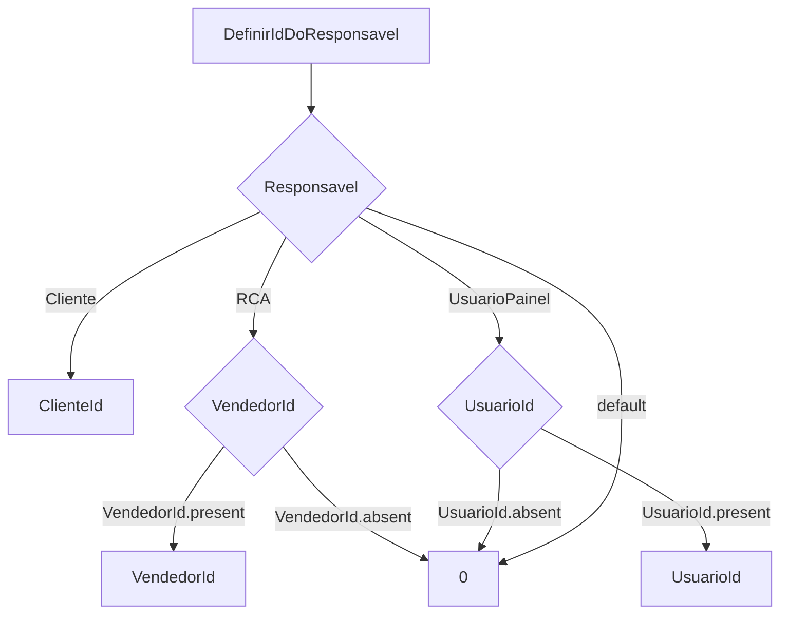
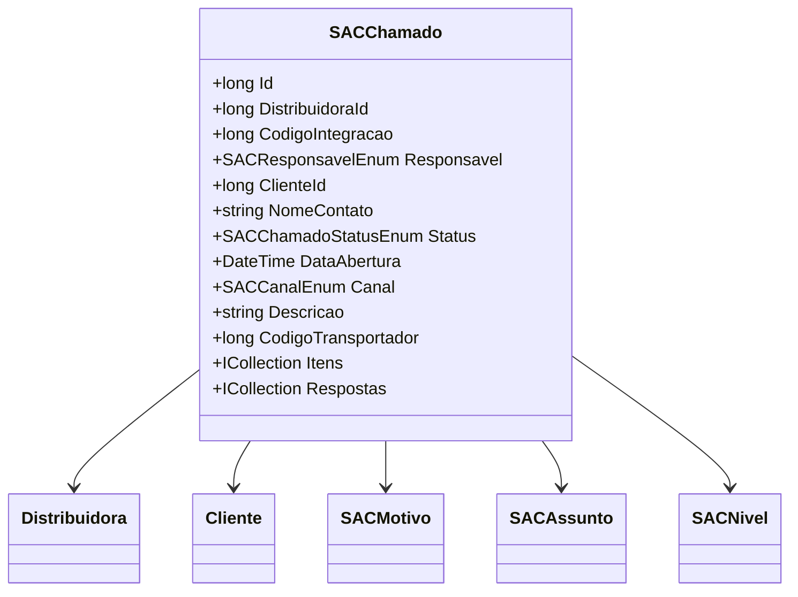

# SACChamado

**Namespace**: IsthmusWinthor.Dominio.Entidades  
**Nome do Arquivo**: SACChamado.cs  

## Visão Geral e Responsabilidade
A classe `SACChamado` representa um chamado no sistema de atendimento ao cliente, permitindo a gestão e o acompanhamento dos serviços prestados. Essa classe é central para a lógica de negócios relacionada ao suporte ao cliente e à interação com distribuidores, clientes e produtos. O chamado armazena informações relevantes, como dados do cliente, do vendedor e do status do chamado, e provê métodos para anexar arquivos e determinar o responsável pelo chamado.

## Métodos de Negócio

### Título: `AnexarArquivo(SACAnexoDTO anexo)` - Public
- **Objetivo**: Este método garante que um arquivo de anexo seja adicionado ao chamado, atualizando a lista de anexos de maneira incremental.
- **Comportamento**:
  1. Recupera a lista atual de anexos utilizando `AnexosLista`.
  2. Define a data do anexo como a data e hora atuais.
  3. Atribui uma ordem ao anexo, aumentando a ordem do último anexo existente ou iniciando com 1 se for o primeiro.
  4. Adiciona o novo anexo à lista.
  5. Serializa a lista atualizada de anexos e armazena como uma string em `Anexos`.
- **Retorno**: Este método não retorna valores; ele atualiza o estado interno da classe.

### Título: `AnexarArquivoDeDevolucao(SACAnexoDTO anexo)` - Public
- **Objetivo**: Similar ao método `AnexarArquivo`, mas específico para anexar arquivos de devolução ao chamado.
- **Comportamento**:
  1. Recupera a lista atual de anexos de devolução utilizando `AnexosDevolucaoLista`.
  2. Define a data do anexo como a data e hora atuais.
  3. Atribui uma ordem ao anexo, utilizando a lógica máxima aplicada na lista de devoluções.
  4. Adiciona a devolução à lista de anexos.
  5. Serializa a lista e armazena o resultado em `AnexosDevolucao`.
- **Retorno**: Este método não retorna valores; ele atualiza o estado interno da classe.

### Título: `DefinirIdDoResponsavel()` - Private
- **Objetivo**: Define o ID do responsável pelo chamado baseado no enum `Responsavel`.
- **Comportamento**:
  1. Usa um switch case para determinar o responsável:
      - Se for cliente, retorna `ClienteId`.
      - Se for vendedor, retorna `VendedorId` ou 0 se não estiver presente.
      - Se for usuário do painel, retorna `UsuarioId` ou 0 se não estiver presente.
      - Retorna 0 para outros casos.
- **Retorno**: Retorna o ID do responsável, podendo ser `0` quando não houver um responsável definido.

### Visualização

## Propriedades Calculadas e de Validação

### Propriedades
- **`StatusDescricao`**: Retorna uma descrição amigável do status do chamado, convertendo o enum `SACChamadoStatusEnum` usando a utilidade `UtilEnumDescription`.
  
- **`ResponsavelId`**: Calcula o ID do responsável com base na lógica do método `DefinirIdDoResponsavel`.

- **`AnexosLista`**: Deserializa a string de anexos em uma lista de `SACAnexoDTO`, assegurando que a lista retornará vazia se houver exceções na deserialização.

- **`Meio`**: Retorna uma string identificando o meio de comunicação baseado no `DistribuidoraId`.

- **`StatusERP`**: Converte o status do chamado para um valor ERP correspondente utilizando o `SACChamadoStatusEnumService`.

## Navigations Property
- [`Distribuidora`](Distribuidora.md)
- [`Cliente`](Cliente.md)
- [`SACMotivo`](SACMotivo.md)
- [`SACAssunto`](SACAssunto.md)
- [`SACNivel`](SACNivel.md)
- [`ICollection<SACItemChamado>`](SACItemChamado.md)
- [`ICollection<SACResposta>`](SACResposta.md)

## Tipos Auxiliares e Dependências
- [`SACResponsavelEnum`](SACResponsavelEnum.md)
- [`SACChamadoStatusEnum`](SACChamadoStatusEnum.md)
- [`SACCanalEnum`](SACCanalEnum.md)
- [`SACDevolucaoEnum`](SACDevolucaoEnum.md)
- [`SACInformacaoFinalizacao`](SACInformacaoFinalizacao.md)
- [`SACAnexoDTO`](SACAnexoDTO.md)
- [`DateTimeUtil`](DateTimeUtil.md)

## Diagrama de Relacionamentos

