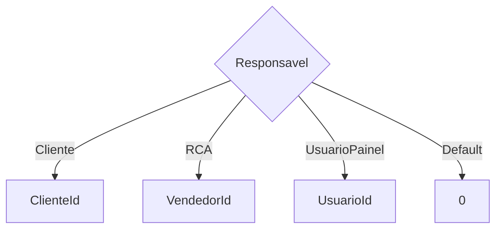
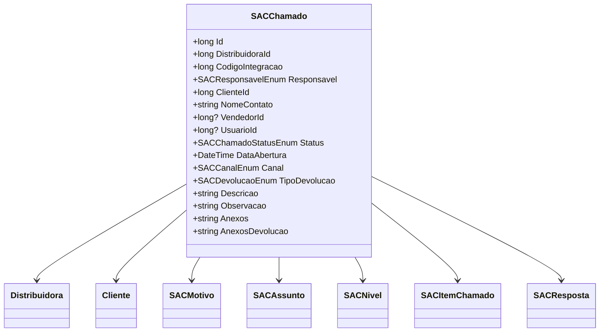

# SACChamado
**Namespace**: IsthmusWinthor.Dominio.Entidades  
**Nome do Arquivo**: SACChamado.cs  

## Visão Geral e Responsabilidade
A classe `SACChamado` representa um chamado na Central de Atendimento ao Cliente (SAC) de uma distribuidora. Ela é responsável por gerenciar as informações relacionadas ao chamado, incluindo detalhes do cliente, status do chamado e anexos. O objetivo principal da classe é fornecer uma estrutura para registrar e manipular as interações entre a distribuidora e o cliente, garantindo que os chamados sejam tratados de maneira organizada e eficiente.

## Métodos de Negócio

### Título: AnexarArquivo (public)
- **Objetivo**: Este método permite anexar um arquivo a um chamado. Ele garante que os anexos sejam armazenados de forma ordenada e que cada anexo mantenha a data em que foi anexado.
- **Comportamento**: 
  1. Obtém a lista atual de anexos usando `AnexosLista`.
  2. Define a data do anexo usando a data atual.
  3. Determina a ordem do novo anexo com base na ordem dos anexos existentes.
  4. Adiciona o novo anexo à lista e serializa a lista de volta para a propriedade `Anexos`.
- **Retorno**: Não retorna um valor.

### Título: AnexarArquivoDeDevolucao (public)
- **Objetivo**: Permite anexar um arquivo de devolução a um chamado, seguindo uma lógica similar ao método `AnexarArquivo`.
- **Comportamento**: 
  1. Obtém a lista atual de anexos de devolução usando `AnexosDevolucaoLista`.
  2. Define a data do anexo usando a data atual.
  3. Determina a ordem do novo anexo de devolução com base na ordem dos anexos existentes.
  4. Adiciona o novo anexo à lista e serializa a lista de volta para a propriedade `AnexosDevolucao`.
- **Retorno**: Não retorna um valor.

### Título: DefinirIdDoResponsavel (private)
- **Objetivo**: Este método determina o ID do responsável pelo chamado com base no enum `Responsavel`. Ele assegura que o ID correto é atribuído, dependendo de quem é o responsável pelo chamado.
- **Comportamento**: 
  1. Usa um switch para verificar o valor da propriedade `Responsavel`.
  2. Atribui o ID com base no tipo de responsável (Cliente, RCA, ou Usuário do Painel).
  3. Se não houver um responsável definido, retorna 0.
- **Retorno**: Um `long` que representa o ID do responsável.

#### VISUALIZAÇÃO:

## Propriedades Calculadas e de Validação
- **StatusDescricao**: Retorna uma descrição do status do chamado utilizando a descrição do enum `SACChamadoStatusEnum`.
- **ResponsavelId**: Calcula o ID do responsável de acordo com a lógica definida no método `DefinirIdDoResponsavel`.
- **NomeContatoIntegracao**: Valida e limita o nome do contato a 40 caracteres para integração.
- **ObservacaoIntegracao**: Valida e limita a observação a 4000 caracteres para integração.

## Navigation Properties
- [Distribuidora](Distribuidora.md)
- [Cliente](Cliente.md)
- [SACMotivo](SACMotivo.md)
- [SACAssunto](SACAssunto.md)
- [SACNivel](SACNivel.md)
- [SACItemChamado](SACItemChamado.md)
- [SACResposta](SACResposta.md)

## Tipos Auxiliares e Dependências
- [SACResponsavelEnum](SACResponsavelEnum.md)
- [SACChamadoStatusEnum](SACChamadoStatusEnum.md)
- [SACCanalEnum](SACCanalEnum.md)
- [SACDevolucaoEnum](SACDevolucaoEnum.md)
- [SACInformacaoFinalizacao](SACInformacaoFinalizacao.md)
- [SACAnexoDTO](SACAnexoDTO.md)

## Diagrama de Relacionamentos

---
Gerada em 29/12/2025 20:48:33
