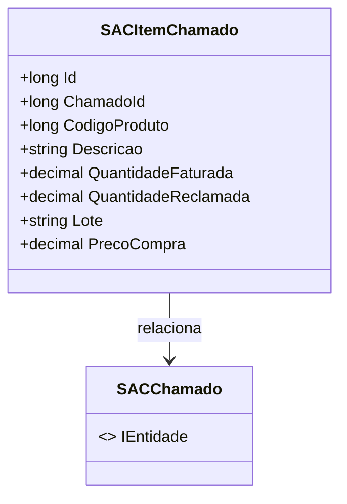

# SACItemChamado
**Namespace**: IsthmusWinthor.Dominio.Entidades  
**Nome do Arquivo**: SACItemChamado.cs  

## Visão Geral e Responsabilidade
A classe `SACItemChamado` representa um item específico associado a um chamado do Serviço de Atendimento ao Cliente (SAC). Seu papel é facilitar o gerenciamento e o rastreamento de informações sobre produtos que estão sendo reclamados, incluindo detalhes como quantidade e preço de compra. Essa classe é essencial para assegurar que os dados relacionados às reclamações de produtos estejam organizados e acessíveis, permitindo ao SAC lidar efetivamente com as solicitações dos clientes.

## Métodos de Negócio
Neste momento, a classe não possui métodos com lógica de negócio complexa a serem destacados.

## Propriedades Calculadas e de Validação
Atualmente, não existem propriedades dentro da classe `SACItemChamado` que contenham lógica no `get` ou validação no `set`.

## Navigation Property
- `Chamado`: `[SACChamado](SACChamado.md)`

## Tipos Auxiliares e Dependências
Atualmente, não foram identificados enumeradores ou classes estáticas/helpers diretamente utilizados por `SACItemChamado`.

## Diagrama de Relacionamentos

