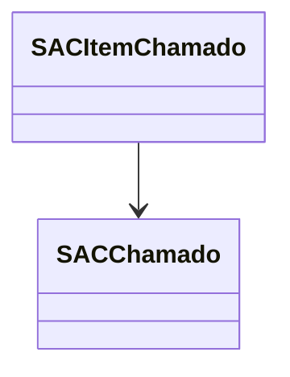

# SACItemChamado
**Namespace**: IsthmusWinthor.Dominio.Entidades  
**Nome do Arquivo**: SACItemChamado.cs  

## Visão Geral e Responsabilidade
A classe `SACItemChamado` representa um item relacionado a um chamado de Serviço de Atendimento ao Cliente (SAC). Sua principal responsabilidade é encapsular as informações pertinentes a cada item reclamado em um chamado, permitindo um controle eficaz sobre quantidades faturadas e reclamadas, além de associar itens a um chamado específico. Esta classe é fundamental para garantir que as interações dos clientes sejam tratadas adequadamente e que os problemas sejam resolvidos de forma eficiente.

## Métodos de Negócio
*A classe SACItemChamado não possui métodos com lógica de negócio além dos acessores.*

## Propriedades Calculadas e de Validação
As propriedades da classe `SACItemChamado` não possuem lógica adicional de validação ou cálculo além das propriedades padrão. Todos os atributos são anêmicos.

## Navigations Property
- [SACChamado](SACChamado.md) - Esta propriedade representa a ligação do item de chamado ao chamado específico dentro da estrutura do atendimento, permitindo o acesso às informações do chamado ao qual o item está associado.

## Tipos Auxiliares e Dependências
A classe `SACItemChamado` não faz uso de tipologias auxiliares ou enumeradores adicionais.

## Diagrama de Relacionamentos

---
Gerada em 29/12/2025 20:48:39
