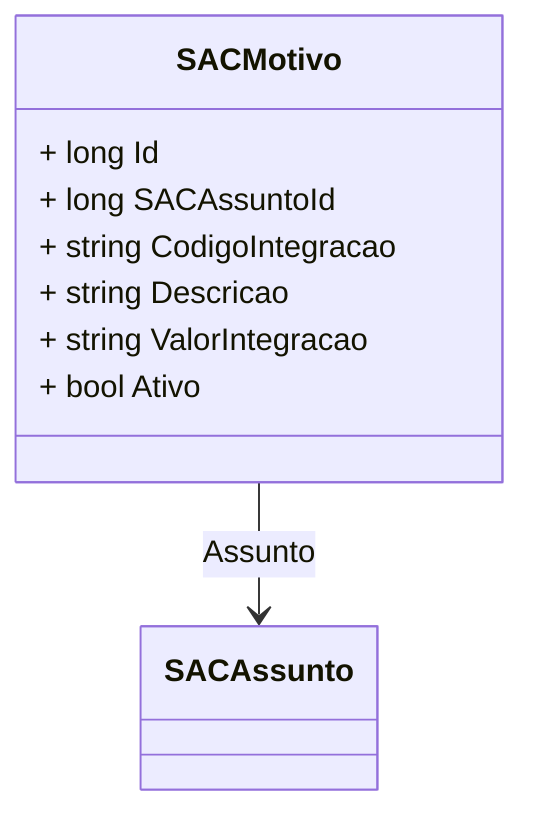

# SACMotivo
**Namespace**: IsthmusWinthor.Dominio.Entidades  
**Nome do Arquivo**: SACMotivo.cs  

## Visão Geral e Responsabilidade
A classe `SACMotivo` representa um motivo associado a um assunto específico dentro de um sistema de Atendimento ao Cliente (SAC). Sua principal responsabilidade é capturar e estruturar informações relacionadas a motivos que podem ser utilizados durante a interação com o cliente, facilitando a categorização de atendimentos e melhorando a resposta do suporte a demandas específicas.

## Métodos de Negócio
Esta classe não possui métodos com lógica de negócios. Todos os métodos são simples getters e setters.

## Propriedades Calculadas e de Validação
Não existem propriedades que implementem lógica no `get` ou validação no `set`.

## Navigations Property
- [SACAssunto](SACAssunto.md)

## Tipos Auxiliares e Dependências
Não existem enumeradores ou classes auxiliares utilizadas por esta classe.

## Diagrama de Relacionamentos

