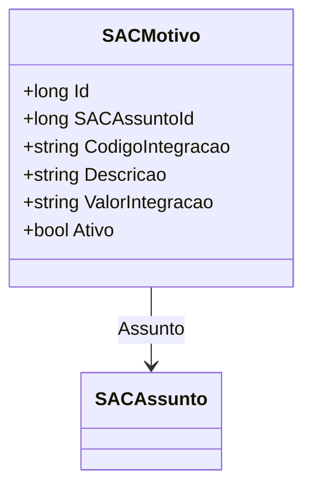

# SACMotivo

**Namespace**: IsthmusWinthor.Dominio.Entidades  
**Nome do Arquivo**: SACMotivo.cs  

## Visão Geral e Responsabilidade
A classe `SACMotivo` representa um motivo dentro do sistema de SAC (Serviço de Atendimento ao Cliente). Seu papel principal é fornecer um contexto para as interações do cliente, associando códigos de integração e descrições que ajudam a categorizar e descrever os motivos das solicitações dos clientes. Ela é essencial para a organização e interpretação dos dados de atendimento ao cliente, permitindo uma resposta mais eficiente às suas necessidades.

## Métodos de Negócio
Atualmente, a classe `SACMotivo` não possui métodos com lógica de negócio. Ela se concentra em armazenar dados relacionados a motivos de atendimento.

## Propriedades Calculadas e de Validação
A classe `SACMotivo` possui propriedades simples que não possuem lógica de cálculo ou validação embutida. Todas as propriedades atuam como campos de dados anêmicos.

## Navigation Property
- [SACAssunto](SACAssunto.md): Essa propriedade representa uma associação com a classe `SACAssunto`, que fornece contexto adicional sobre o assunto relacionado ao motivo.

## Tipos Auxiliares e Dependências
Atualmente, a classe `SACMotivo` não utiliza nenhum enumerador ou classe auxiliar. Ela depende apenas da interface `IEntidade` do namespace `Base.Dominio`.

## Diagrama de Relacionamentos

---
Gerada em 29/12/2025 20:48:45
