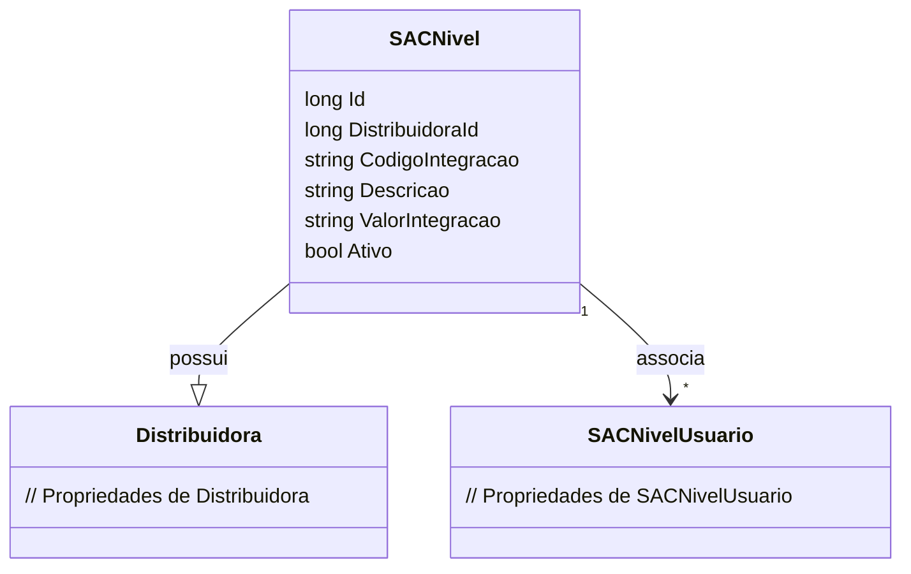

# SACNivel
**Namespace**: IsthmusWinthor.Dominio.Entidades  
**Nome do Arquivo**: SACNivel.cs  

## Visão Geral e Responsabilidade
A classe `SACNivel` representa um nível no Sistema de Atendimento ao Cliente (SAC) dentro do domínio da aplicação. Ela encapsula informações sobre a distribuidora associada, bem como detalhes de integração e status do nível. Seu objetivo é gerenciar os níveis de atendimento e vincular usuários relevantes a cada nível, assegurando assim que as interações com os clientes estejam organizadas de maneira eficiente e escalável.

## Métodos de Negócio
Atualmente, a classe `SACNivel` não possui métodos com lógica de negócio complexa implementada, sendo assim, não há detalhamentos a serem feitos nesta seção.

## Propriedades Calculadas e de Validação
- **Ativo**: Esta propriedade é utilizada para indicar se o nível de SAC está ativo ou não. A regra de negócio aqui é que apenas níveis ativos podem ser utilizados nas operações de atendimento ao cliente.

## Navigations Property
- [Distribuidora](Distribuidora.md): Representa a entidade associada que fornece informações sobre a distribuidora desse nível.
- [SACNivelUsuario](SACNivelUsuario.md): Uma coleção que liga usuários ao nível de atendimento, permitindo o gerenciamento dos atendentes disponíveis.

## Tipos Auxiliares e Dependências
- Não há enumeradores, classes estáticas ou helpers sendo utilizados diretamente na classe `SACNivel`.

## Diagrama de Relacionamentos

---
Gerada em 29/12/2025 20:48:54
