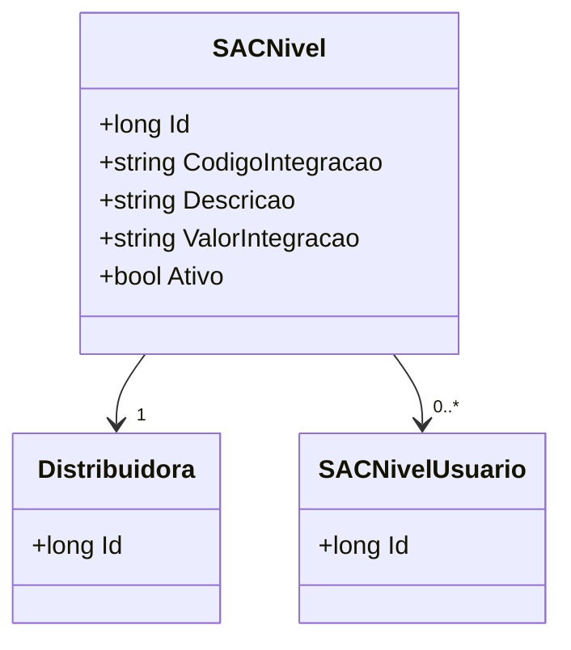

# SACNivel
**Namespace**: IsthmusWinthor.Dominio.Entidades  
**Nome do Arquivo**: SACNivel.cs  

## Visão Geral e Responsabilidade
A classe `SACNivel` representa uma entidade no domínio do sistema, relacionada à estrutura de níveis de atendimento do serviço ao cliente. O objetivo principal dessa classe é gerenciar as informações sobre os níveis de suporte oferecidos pela distribuidora. Ela modela a relação entre a distribuidora e os diversos usuários que podem se relacionar com esses níveis, garantindo que todas as informações integradas e status estejam devidamente organizados e acessíveis.

## Métodos de Negócio
N/A - A classe `SACNivel` não contém métodos de negócio com lógica complexa, apenas propriedades que representam dados.

## Propriedades Calculadas e de Validação
- Propriedade `Ativo`: Esta propriedade é um indicador booleano que determina se o nível de atendimento está ativo. Validações podem ser necessárias para garantir que apenas níveis ativos sejam utilizados nas operações do sistema.

## Navigations Property
- `Distribuidora`: Representa a relação com a classe complexa do domínio (ou agregada) em `[Distribuidora](Distribuidora.md)`.
- `SACNivelUsuarios`: Representa uma coleção de relacionamentos com usuários específicos no nível de atendimento do SAC (ou seja, `[SACNivelUsuario](SACNivelUsuario.md)`).

## Tipos Auxiliares e Dependências
- Enumeradores e classes auxiliares utilizadas:
  - N/A - Esta classe não depende de nenhum tipo auxiliar.

## Diagrama de Relacionamentos

