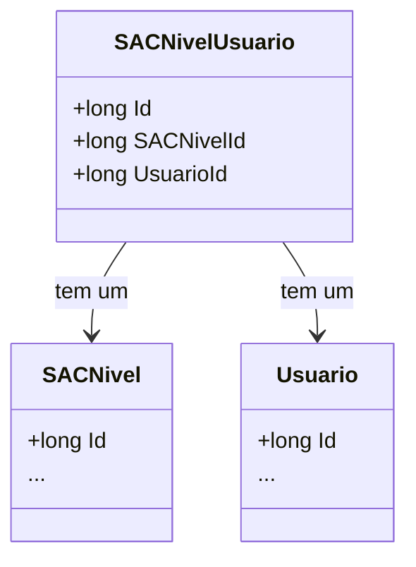

# SACNivelUsuario
**Namespace**: IsthmusWinthor.Dominio.Entidades  
**Nome do Arquivo**: SACNivelUsuario.cs

## Visão Geral e Responsabilidade
A classe `SACNivelUsuario` representa uma entidade de associação entre usuários e níveis de serviço (SAC). Ela é responsável por gerenciar a relação entre um usuário específico e seu nível de acesso ou categoria dentro do sistema de Atendimento ao Cliente (SAC). A implementação dessa classe é fundamental para garantir que a estrutura de níveis de usuários seja mantida e que as permissões e acessos sejam corretamente aplicados.

## Métodos de Negócio
*Esta classe não contém métodos com lógica de negócio significativa. Portanto, não há métodos a serem documentados nesse formato.*

## Propriedades Calculadas e de Validação
*Esta classe não contém propriedades com lógica no `get` ou validações no `set` que justifiquem documentação adicional.*

## Navigation Property
- [SACNivel](SACNivel.md): Representa a classe que define o nível de acesso no sistema.
- [Usuario](Usuario.md): Representa a classe que define o usuário que está associado a um nível de serviço.

## Tipos Auxiliares e Dependências
*Não há enumeradores ou classes estáticas/helpers utilizadas diretamente por esta classe.*

## Diagrama de Relacionamentos

---
Gerada em 29/12/2025 20:49:02
