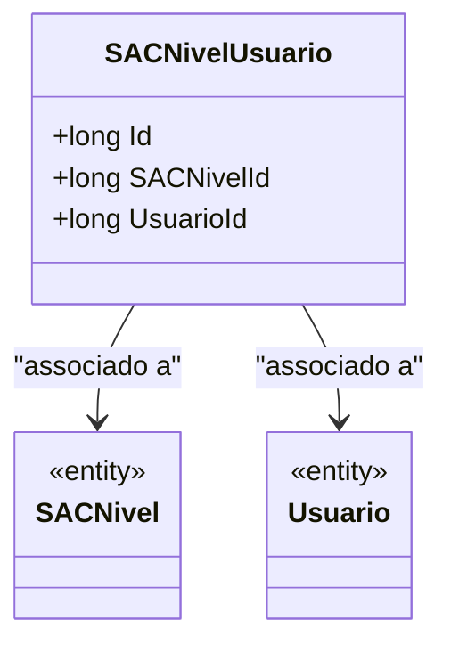

# SACNivelUsuario
**Namespace**: IsthmusWinthor.Dominio.Entidades  
**Nome do Arquivo**: SACNivelUsuario.cs  

## Visão Geral e Responsabilidade
A classe `SACNivelUsuario` desempenha um papel crucial na modelagem do relacionamento entre usuários e níveis de acesso (SACNiveis) dentro do sistema. Ela representa a atribuição de um nível a um usuário, garantindo que os usuários tenham acesso adequado aos recursos e funcionalidades do sistema de acordo com seu nível de permissão. Esta classe ajuda a manter a integridade dos dados ao assegurar que cada usuário esteja associado a um nível específico.

## Métodos de Negócio
Esta classe não possui métodos com lógica de negócio, uma vez que serve basicamente como um mapeamento entre entidades.

## Propriedades Calculadas e de Validação
Não existem propriedades com lógica de cálculo ou validação que sobrescrevam o comportamento padrão.

## Navigations Property
- [`SACNivel`](SACNivel.md): Representa a entidade de nível, que descreve o nível de acesso do usuário no sistema.
- [`Usuario`](Usuario.md): Representa a entidade usuário, que identifica a pessoa ou sistema que está interagindo com o sistema.

## Tipos Auxiliares e Dependências
Não existem enumeradores ou classes estáticas/helpers associadas diretamente a esta classe.

## Diagrama de Relacionamentos

