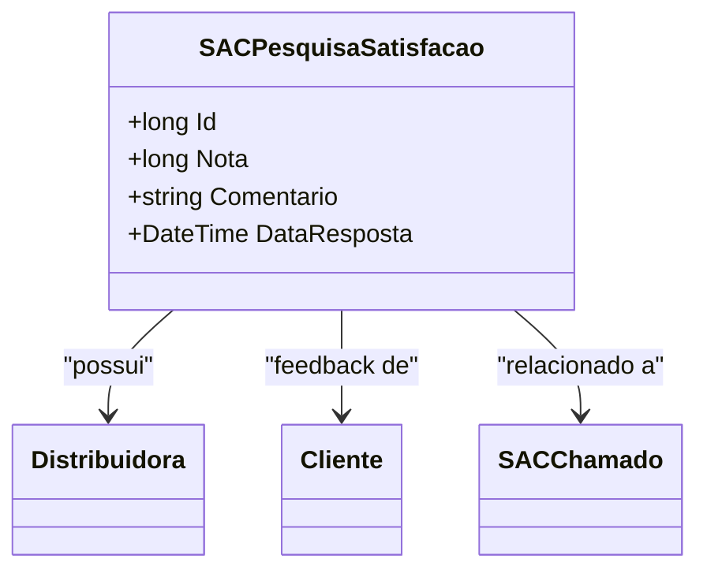

# SACPesquisaSatisfacao
**Namespace**: IsthmusWinthor.Dominio.Entidades  
**Nome do Arquivo**: SACPesquisaSatisfacao.cs  

## Visão Geral e Responsabilidade
A classe `SACPesquisaSatisfacao` representa a entidade que coleta feedback de clientes sobre o atendimento recebido, após a resolução de um chamado no sistema SAC (Serviço de Atendimento ao Cliente). Essa classe atua como um motor de avaliação, armazenando notas e comentários que permitem medir a satisfação do cliente com o serviço prestado, possibilitando melhorias contínuas na equipe de atendimento e na abordagem ao cliente.

## Métodos de Negócio
*Nota: Esta classe não possui métodos de negócio complexos definidos, apenas getters e setters simples. Portanto, essa seção não se aplica.*

## Propriedades Calculadas e de Validação
- Esta classe não possui propriedades que contenham lógica no `get` ou validações no `set`. Todos os atributos são de acesso direto sem cálculos ou validações.

## Navigations Property
- [Distribuidora](Distribuidora.md): Refere-se à distribuidora associada ao cliente.
- [Cliente](Cliente.md): Representa o cliente que forneceu o feedback.
- [SACChamado](SACChamado.md): O chamado relacionado a essa pesquisa de satisfação.

## Tipos Auxiliares e Dependências
- Nenhum tipo auxiliar, enumerador ou classe estática/utility é utilizado nesta classe.

## Diagrama de Relacionamentos

---
Gerada em 29/12/2025 20:49:10
