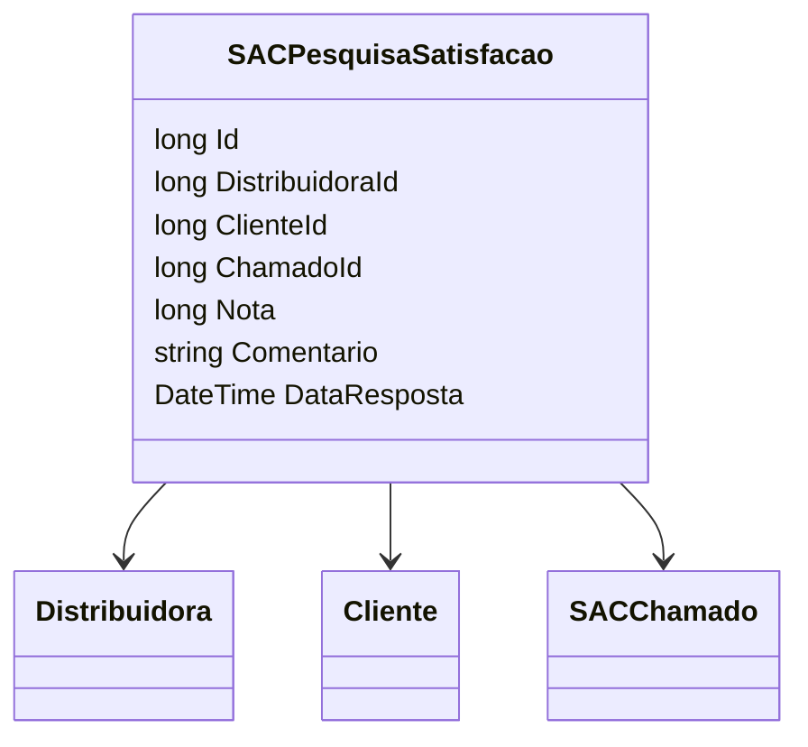

# SACPesquisaSatisfacao
**Namespace**: IsthmusWinthor.Dominio.Entidades  
**Nome do Arquivo**: SACPesquisaSatisfacao.cs  

## Visão Geral e Responsabilidade
A classe `SACPesquisaSatisfacao` representa uma pesquisa de satisfação realizada por clientes em relação ao atendimento recebido através do SAC (Serviço de Atendimento ao Cliente). O principal objetivo desta classe é capturar as opiniões dos clientes, quantificadas por uma nota e um comentário, de forma a monitorar e melhorar a qualidade do atendimento prestado. Essa classe desempenha um papel vital na análise de dados de satisfação e na retroalimentação dos processos de atendimento.

## Métodos de Negócio
Não há métodos de negócios com lógica na classe.

## Propriedades Calculadas e de Validação
Não existem propriedades que contenham lógica no `get` ou validação no `set`.

## Navigation Property
- [Distribuidora](Distribuidora.md): Representa a distribuidora associada à pesquisa de satisfação.
- [Cliente](Cliente.md): Representa o cliente que realizou a pesquisa.
- [SACChamado](SACChamado.md): Representa o chamado para o qual a pesquisa de satisfação está associada.

## Tipos Auxiliares e Dependências
Não há enumeradores ou classes auxiliares utilizadas nesta classe.

## Diagrama de Relacionamentos

