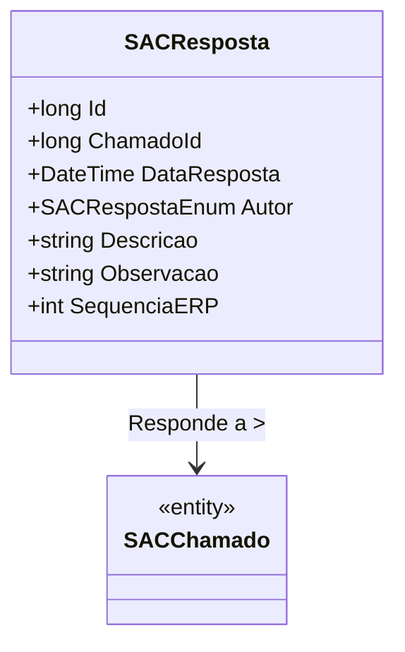

# SACResposta
**Namespace**: IsthmusWinthor.Dominio.Entidades  
**Nome do Arquivo**: SACResposta.cs  

## Visão Geral e Responsabilidade
A classe `SACResposta` representa uma resposta a um chamado dentro do sistema de Atendimento ao Cliente (SAC). Ela é responsável por armazenar informações relevantes sobre a resposta, como seu autor, a data em que foi emitida, e a sequência utilizada no sistema ERP. O papel da classe é garantir que as respostas aos chamados sejam adequadamente organizadas e vinculadas ao chamado correspondente, permitindo um acompanhamento apropriado das interações no atendimento.

## Métodos de Negócio
Nenhum método com lógica de negócio significativa foi identificado nesta classe, pois as operações primárias se concentram em armazenar dados e as relações entre as entidades.

## Propriedades Calculadas e de Validação
Nenhuma propriedade com lógica de validação ou cálculo significativo foi identificada nesta classe. Todas as propriedades servem essencialmente como transportadores de dados sem lógica adicional.

## Navigations Property
- `Chamado`: Representa a referência a um objeto do tipo `[SACChamado](SACChamado.md)`, que é o chamado ao qual esta resposta está associada.

## Tipos Auxiliares e Dependências
- `SACRespostaEnum`: Enum utilizado para representar o autor da resposta.
- A classe pode ter dependências que não estão explicitamente listadas, mas pode interagir com o repositório ou serviços relacionados ao `SACChamado`.

## Diagrama de Relacionamentos

Este documento fornece uma visão compreensiva da classe `SACResposta`, destacando seu papel dentro do domínio e suas interações com outras entidades relevantes.
