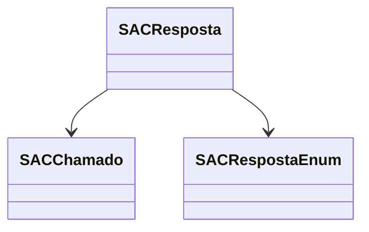

# SACResposta
**Namespace**: IsthmusWinthor.Dominio.Entidades  
**Nome do Arquivo**: SACResposta.cs  

## Visão Geral e Responsabilidade
A classe `SACResposta` representa uma resposta a um chamado dentro de um sistema de atendimento ao cliente (SAC). Essa classe é responsável por manter as informações relacionadas às respostas registradas, vinculadas a um chamado específico. O problema de negócio que ela resolve é a necessidade de registrar as interações dos atendentes com os clientes, assegurando que cada resposta esteja associada a um chamado e que as informações sobre a resposta sejam mantidas de forma estruturada e acessível.

## Métodos de Negócio
Atualmente, a classe `SACResposta` não possui métodos de negócio com lógica complexa, sendo composta essencialmente por propriedades.

## Propriedades Calculadas e de Validação
Atualmente, a classe `SACResposta` não apresenta propriedades com lógica de cálculo no `get` ou validação no `set`. Todas as propriedades são anêmicas e não contêm regras de negócio embutidas.

## Navigation Property
- `Chamado`: [SACChamado](SACChamado.md)

## Tipos Auxiliares e Dependências
- `SACRespostaEnum`: [SACRespostaEnum](SACRespostaEnum.md)

## Diagrama de Relacionamentos

---
Gerada em 29/12/2025 20:49:17
