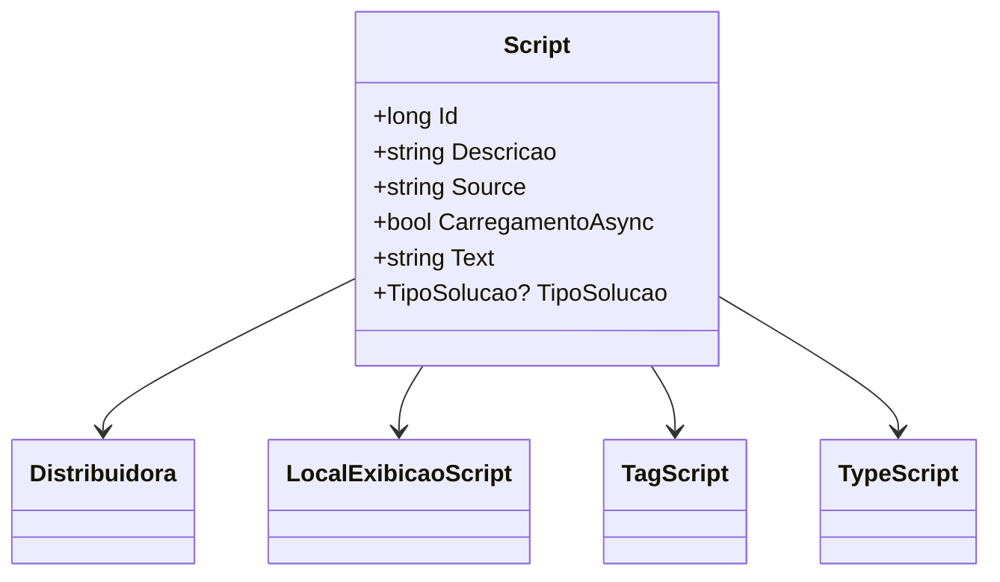

# Script
**Namespace**: IsthmusWinthor.Dominio.Entidades  
**Nome do Arquivo**: Script.cs  

## Visão Geral e Responsabilidade
A classe `Script` serve como uma entidade do domínio que modela um script a ser associado a uma `Distribuidora`. Ela é responsável por encapsular as informações relevantes que descrevem um script, como sua descrição, local de exibição, tipo de script e outras propriedades que definem seu comportamento no sistema. Essa estrutura é fundamental para a gestão de scripts em um sistema que envolve automação ou execução de tarefas relacionadas a distribuições. A classe também é projetada para permitir o controle da execução assíncrona de scripts.

## Métodos de Negócio
*Nenhum método complexo foi identificado nesta classe*.

## Propriedades Calculadas e de Validação
- Não há propriedades com lógica de cálculo ou validação no `get` ou `set`.

## Navigations Property
- `Distribuidora`: classe que representa a distribuidora associada ao script. 
  - [Distribuidora](Distribuidora.md)

## Tipos Auxiliares e Dependências
- `LocalExibicaoScript`: enum que define as possíveis localizações onde o script pode ser exibido.
  - [LocalExibicaoScript](LocalExibicaoScript.md)
- `TagScript`: enum que categoriza os scripts.
  - [TagScript](TagScript.md)
- `TypeScript`: enum que define o tipo de script.
  - [TypeScript](TypeScript.md)
- `TipoSolucao`: enum que representa diferentes tipos de soluções associadas ao script.
  - [TipoSolucao](TipoSolucao.md)

## Diagrama de Relacionamentos

