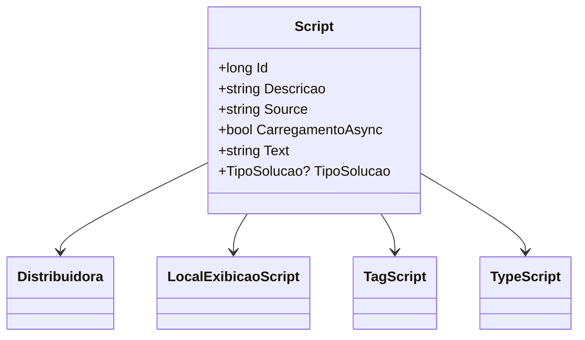

# Script

**Namespace**: IsthmusWinthor.Dominio.Entidades  
**Nome do Arquivo**: Script.cs  

## Visão Geral e Responsabilidade
A classe `Script` representa uma entidade do domínio que encapsula a lógica e os dados relacionados a um script dentro de um sistema de processamento de dados. Ela está relacionada à execução de scripts que podem ser geridos por uma distribuidora, abrangendo aspectos como descrição, local de exibição, tags, tipo e fonte do script. O principal problema de negócio que essa classe resolve é o gerenciamento eficaz e a configuração de scripts, permitindo a flexibilidade na execução e apresentação dos dados.

## Métodos de Negócio
No momento, a classe `Script` não contém métodos de negócios com lógica complexa, focando principalmente em propriedades que definem suas características.

## Propriedades Calculadas e de Validação
Atualmente, não foram encontradas propriedades com lógica de cálculo ou validação no `get` ou `set`.

## Navigations Property
- [Distribuidora](Distribuidora.md): Representa a distribuidora associada ao script.
- [LocalExibicaoScript](LocalExibicaoScript.md): Representa onde o script será exibido.
- [TagScript](TagScript.md): Tags para categorização do script.
- [TypeScript](TypeScript.md): Define o tipo do script.

## Tipos Auxiliares e Dependências
- [LocalExibicaoScript](LocalExibicaoScript.md): Enum que determina os possíveis locais de exibição.
- [TagScript](TagScript.md): Enum que categoriza os tipos de tags para o script.
- [TypeScript](TypeScript.md): Enum que define os tipos de script.
- [TipoSolucao](TipoSolucao.md): Enum que representa os tipos de soluções associadas.

## Diagrama de Relacionamentos

---
Gerada em 29/12/2025 20:49:26
