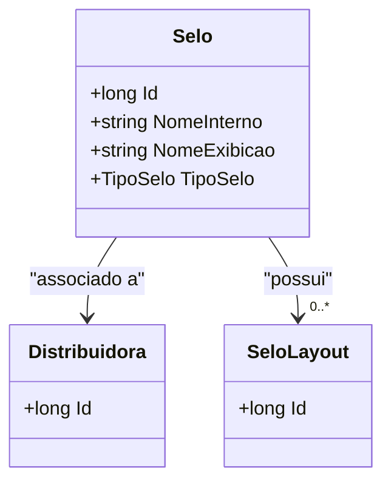

# Selo
**Namespace**: IsthmusWinthor.Dominio.Entidades  
**Nome do Arquivo**: Selo.cs  

## Visão Geral e Responsabilidade
A classe `Selo` representa a entidade que possui informações relacionadas a um selo de distribuição. Ela é responsável por associar um selo a uma distribuidora específica, armazenar tanto o nome interno quanto o nome para exibição do selo, e categorizar o selo de acordo com um tipo específico. Esta classe é fundamental para o gerenciamento e categorização de selos dentro do sistema, garantindo que as informações sejam corretamente associadas e classificadas para facilitar operações no negócio.

## Métodos de Negócio
A classe `Selo` não contém métodos com lógica complexa além dos getters e setters simples. Portanto, não há métodos de negócio a serem documentados.

## Propriedades Calculadas e de Validação
A classe não possui propriedades que implementem lógica complexa em seus `get` ou validação nos `set`. As propriedades são anêmicas e simples.

## Navigations Property
- [Distribuidora](Distribuidora.md) - Referência à distribuidora associada ao selo.
- [SeloLayout](SeloLayout.md) - Coleção de layouts associados ao selo.

## Tipos Auxiliares e Dependências
- [TipoSelo](TipoSelo.md) - Enum que representa os tipos de selo disponíveis.

## Diagrama de Relacionamentos

---
Gerada em 29/12/2025 20:49:33
