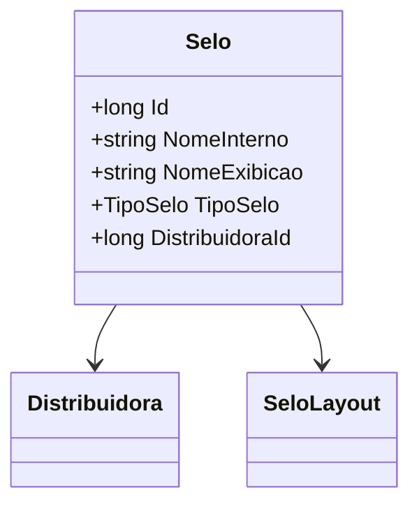

# Selo
**Namespace**: IsthmusWinthor.Dominio.Entidades  
**Nome do Arquivo**: Selo.cs

## Visão Geral e Responsabilidade
A classe `Selo` representa uma entidade no domínio de um sistema de gestão de distribuição. Seu papel principal é gerenciar as informações e as associações dos selos utilizados pelas distribuidoras. Um selo pode ser visualizado como uma identificação visual ou etiqueta que informa características de um produto ou serviço. Ele é essencial para garantir a rastreabilidade e a categorização dos produtos disponibilizados pelas distribuidoras, o que é crucial para conformidade e marketing.

## Métodos de Negócio
Nenhum método que contenha lógica foi implementado na classe `Selo`, pois a atual implementação oferece apenas propriedades básicas para o transporte dos dados.

## Propriedades Calculadas e de Validação
Nenhuma propriedade com lógica de cálculo ou validação foi identificada na classe `Selo`.

## Navigations Property
- `[Distribuidora](Distribuidora.md)`: Representa a distribuidora associada ao selo.
- `[SeloLayout](SeloLayout.md)`: Representa uma coleção de layouts associados ao selo.

## Tipos Auxiliares e Dependências
- `[TipoSelo](TipoSelo.md)`: Enumerator que define os tipos de selo disponíveis no sistema.

## Diagrama de Relacionamentos

