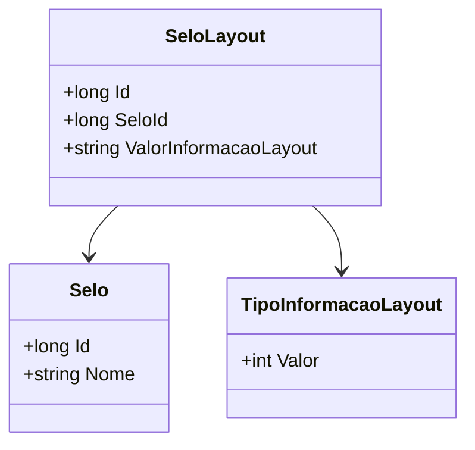

# SeloLayout
- **Namespace**: IsthmusWinthor.Dominio.Entidades
- **Nome do Arquivo**: SeloLayout.cs

## Visão Geral e Responsabilidade
A classe `SeloLayout` representa a estrutura que define o layout de um selo no sistema. Esta classe é responsável por vincular e armazenar informações específicas associadas a um tipo de selo, permitindo que informações sobre o layout do selo sejam organizadas e manipuladas de forma eficiente. O problema de negócio que esta classe resolve é a necessidade de gerenciar e armazenar diferentes informações sobre selos de forma estruturada, facilitando o uso dessas informações em processos de validação e visualização.

## Métodos de Negócio
### Método: Nenhum método de negócio presente.
Não há métodos com lógica complexa nesta classe, portanto, não há documentação adicional a ser feita neste espaço.

## Propriedades Calculadas e de Validação
### Propriedades:
- **ValorInformacaoLayout**: Esta propriedade armazena o valor associado ao layout do selo. Embora não tenha lógica de validação ou cálculo explícita, a integridade dos dados na propriedade deve ser garantida em nível de aplicação, assegurando que o valor inserido corresponda ao tipo de informação do layout.

## Navigation Property
- **Selo**: [Selo](Selo.md)

## Tipos Auxiliares e Dependências
- **Enumeradores**:
  - [TipoInformacaoLayout](TipoInformacaoLayout.md)

## Diagrama de Relacionamentos

---
Gerada em 29/12/2025 20:49:41
