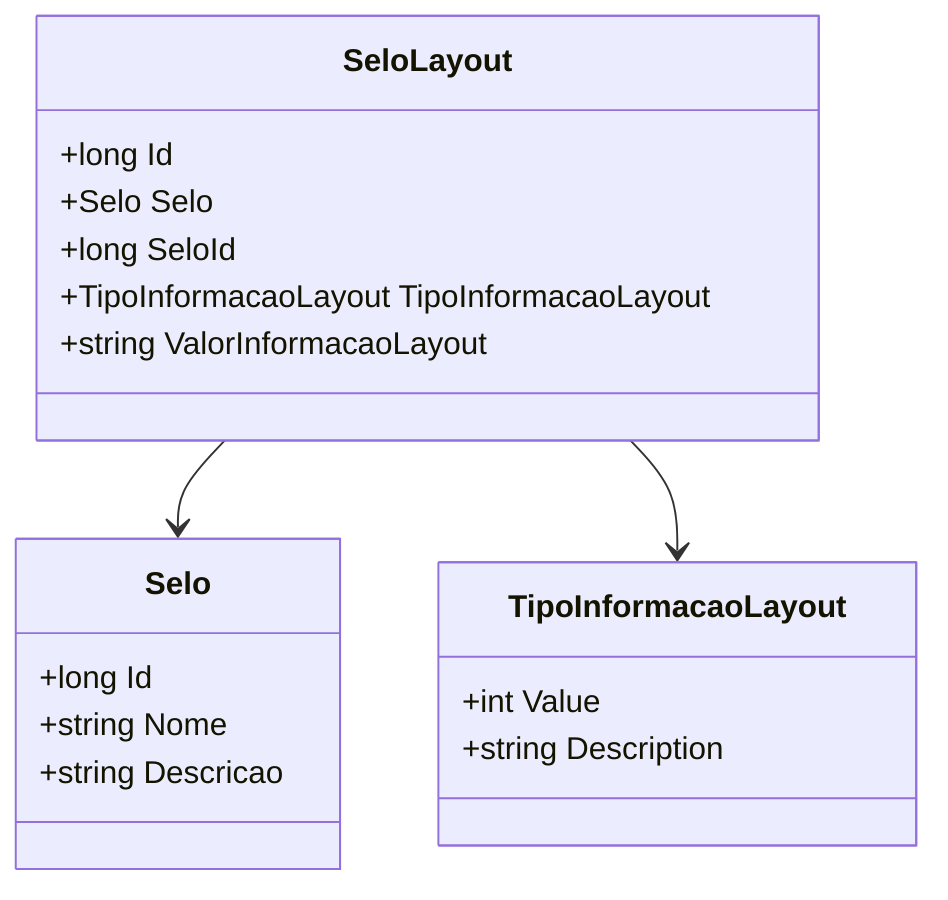

# SeloLayout

- **Namespace**: IsthmusWinthor.Dominio.Entidades
- **Nome do Arquivo**: SeloLayout.cs

## Visão Geral e Responsabilidade
A classe `SeloLayout` representa a estrutura de um layout de selo dentro do sistema. O problema de negócio que ela resolve é a necessidade de armazenar e gerenciar informações específicas que caracterizam um selo, permitindo que distintos tipos de informações sejam associadas a diferentes selos, o que é crucial para a personalização e organização de dados no contexto de uso do sistema.

## Métodos de Negócio
Atualmente, a classe `SeloLayout` não contém métodos de negócio com lógica complexa. Portanto, essa seção está vazia.

## Propriedades Calculadas e de Validação
Não há propriedades com lógica no `get` ou validações no `set` nesta classe.

## Navigations Property
- `[Selo](Selo.md)`

## Tipos Auxiliares e Dependências
- `[TipoInformacaoLayout](TipoInformacaoLayout.md)`

## Diagrama de Relacionamentos

Nesta documentação, apresentamos a classe `SeloLayout`, destacando sua responsabilidade dentro do domínio e as relações que mantém com outras classes relevantes.
