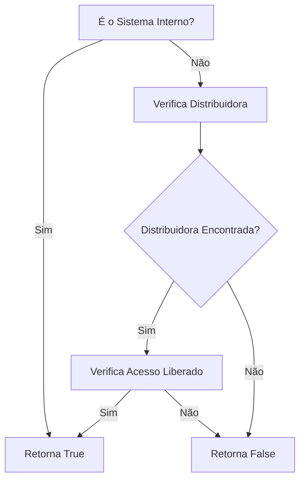
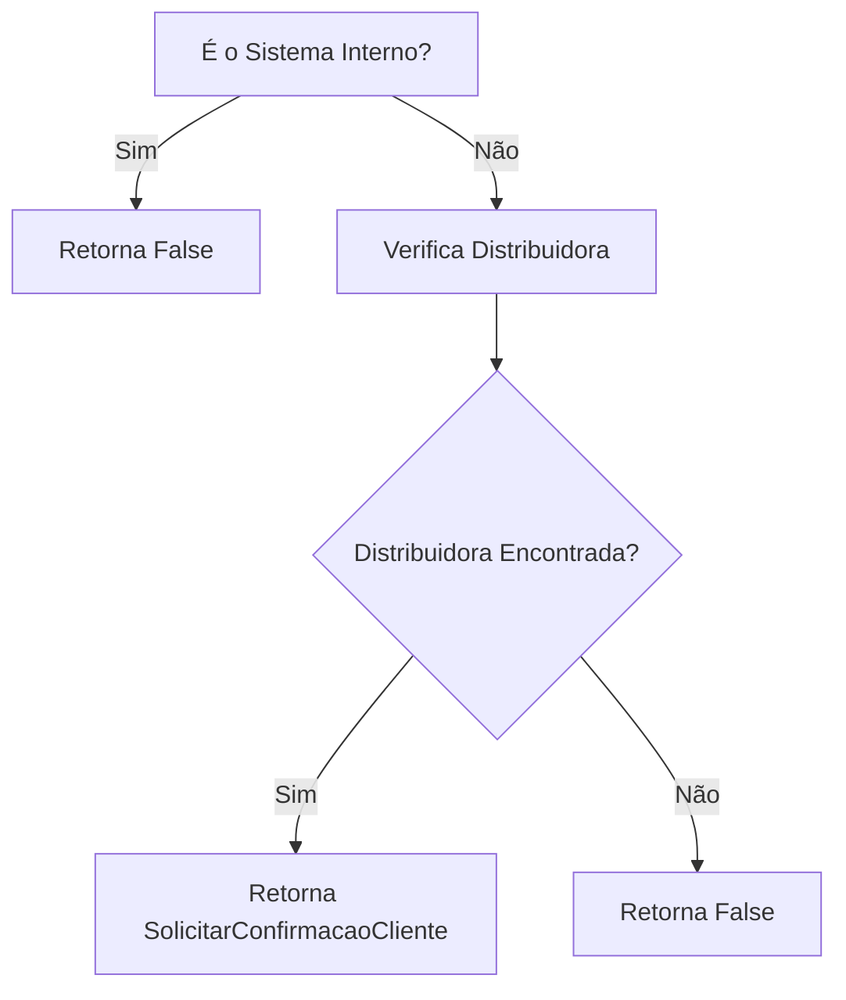
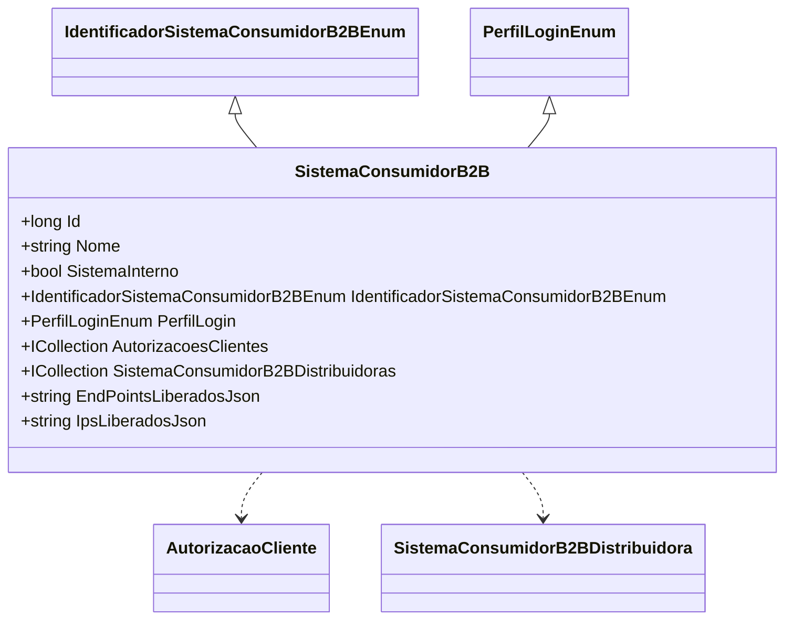

# SistemaConsumidorB2B

**Namespace**: IsthmusWinthor.Dominio.Entidades  
**Nome do Arquivo**: SistemaConsumidorB2B.cs  

## Visão Geral e Responsabilidade
A classe `SistemaConsumidorB2B` representa um sistema que pode acessar funcionalidades do B2B, controlando o acesso com base em sua configuração interna e em um conjunto de distribuidoras autorizadas. Ela trata do gerenciamento de permissões e validações associadas a sistemas consumidores, garantindo que apenas aqueles com as credenciais apropriadas possam interagir com os serviços.

## Métodos de Negócio

### PossuiAcessoDistribuidora (public)
- **Objetivo**: Garante que um sistema consumidor tenha acesso a uma distribuidora específica, considerando se o sistema é interno ou se possui autorização expressa.
- **Comportamento**: 
  1. Verifica se o sistema é marcado como interno (`SistemaInterno`).
     - Se sim, retorna `true`, permitindo o acesso automaticamente.
  2. Se não for interno, pesquisa na coleção `SistemaConsumidorB2BDistribuidoras`.
     - Procura por uma distribuidora cujo `DistribuidoraId` corresponda ao `distribuidoraId` fornecido.
     - Verifica se a propriedade `AcessoLiberado` dessa distribuidora é `true`.
  3. Retorna `true` se a condição anterior for satisfeita, caso contrário, retorna `false`.
- **Retorno**: `true` se o acesso à distribuidora é permitido; `false` se não.

### SolicitarConfirmacaoCliente (public)
- **Objetivo**: Determina se a confirmação do cliente é necessária no processo de criação, baseado na configuração do sistema e na autorização da distribuidora.
- **Comportamento**:
  1. Confere se é um sistema interno (`SistemaInterno`).
     - Se for, retorna `false`, pois a aprovação é automática para sistemas internos.
  2. Se não for interno, procura na coleção `SistemaConsumidorB2BDistribuidoras`.
     - Encontra a distribuidora com o `DistribuidoraId` fornecido e que esteja autorizada (`AcessoLiberado` igual a `true`).
  3. Retorna o valor da propriedade `SolicitarConfirmacaoCliente` (que indica se a confirmação é necessária).
- **Retorno**: `true` se a confirmação do cliente for necessária; `false` se a aprovação for automática.

## Propriedades Calculadas e de Validação

### EndPointsLiberados
- **Regra**: A propriedade `EndPointsLiberados` é uma lista de strings que armazena endpoints permitidos, convertendo-se de e para um formato JSON.
  - Quando acessada, se `EndPointsLiberadosJson` estiver vazio, retorna uma lista vazia.
  - Ao ser atribuída uma nova lista, a coleção é serializada em JSON para armazenamento.

### IpsLiberados
- **Regra**: A propriedade `IpsLiberados` opera de maneira análoga à `EndPointsLiberados`, controlando uma lista de endereços IP autorizados. O acesso e a atribuição seguem as mesmas regras de conversão JSON.

## Navigations Property
- `[AutorizacaoCliente](AutorizacaoCliente.md)`
- `[SistemaConsumidorB2BDistribuidora](SistemaConsumidorB2BDistribuidora.md)`

## Tipos Auxiliares e Dependências
- `[IdentificadorSistemaConsumidorB2BEnum](IdentificadorSistemaConsumidorB2BEnum.md)`
- `[PerfilLoginEnum](PerfilLoginEnum.md)`

## Diagrama de Relacionamentos

