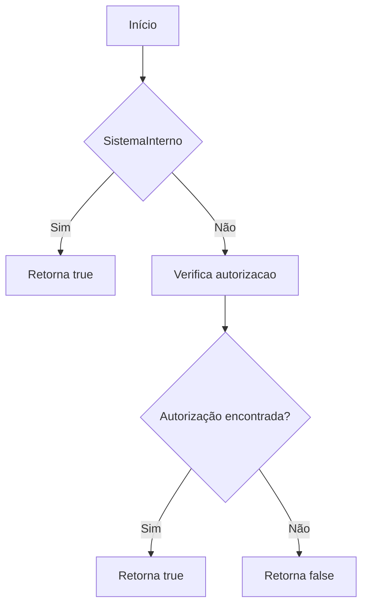
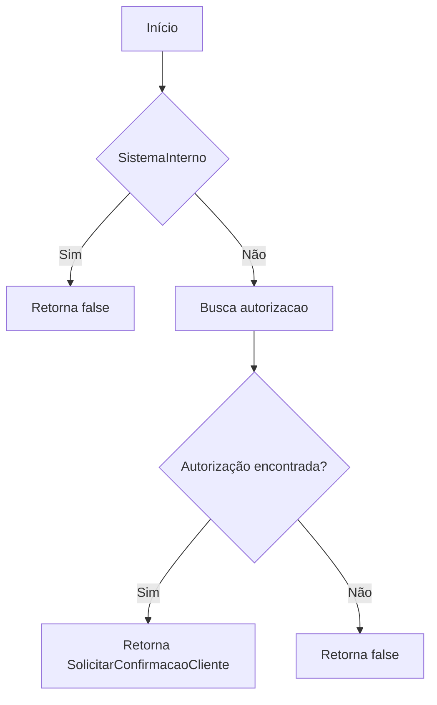
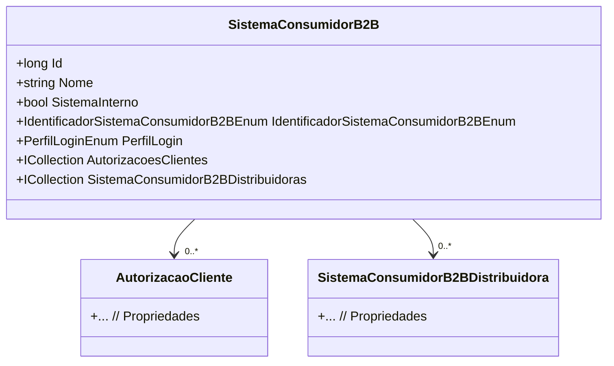

# SistemaConsumidorB2B
**Namespace**: IsthmusWinthor.Dominio.Entidades  
**Nome do Arquivo**: SistemaConsumidorB2B.cs  

## Visão Geral e Responsabilidade
A classe `SistemaConsumidorB2B` representa um sistema que está autorizado a utilizar funções do B2B. Esta classe é responsável por gerenciar a autorização de acesso de sistemas consumidores, definindo se um sistema é interno ou externo e controlando o acesso a partir do cadastro em `SistemaConsumidorB2BDistribuidora`. Isso é crucial para o gerenciamento de permissões e para a segurança do sistema, garantindo que apenas sistemas autorizados possam se conectar.

## Métodos de Negócio

### PossuiAcessoDistribuidora: público
- **Objetivo**: Este método garante que um sistema consumidor B2B tenha acesso a uma distribuidora, levando em consideração se é um sistema interno ou se possui autorização específica.
- **Comportamento**: 
  1. Verifica se `SistemaInterno` é `true`. Se sim, retorna `true`, garantindo acesso irrestrito.
  2. Caso contrário, verifica se existe algum registro em `SistemaConsumidorB2BDistribuidoras` onde o `DistribuidoraId` corresponde ao `distribuidoraId` fornecido e `AcessoLiberado` é `true`.
  3. Retorna `true` se a condição acima for satisfeita, caso contrário, retorna `false`.
- **Retorno**: Retorna um booleano, onde `true` indica que o acesso foi liberado e `false` que o acesso foi negado.

### SolicitarConfirmacaoCliente: público
- **Objetivo**: Este método determina se a aprovação do cliente é necessária para um sistema consumidor B2B, sendo esse um controle necessário para sistemas externos.
- **Comportamento**:
  1. Verifica se `SistemaInterno` é `true`. Se sim, retorna `false`, permitindo a aprovação automática.
  2. Busca no registro `SistemaConsumidorB2BDistribuidoras` um registro correspondente ao `distribuidoraId`, que também esteja com `AcessoLiberado` como `true`.
  3. Retorna o valor de `SolicitarConfirmacaoCliente` do registro encontrado.
- **Retorno**: Retorna um booleano: `true` se a confirmação do cliente for necessária e `false` se a aprovação for automática.

## Propriedades Calculadas e de Validação
- **EndPointsLiberados**: Esta propriedade deserializa uma lista de strings a partir de `EndPointsLiberadosJson`. Se `EndPointsLiberadosJson` for vazio ou inválido, retorna uma lista vazia.
- **IpsLiberados**: Similar a `EndPointsLiberados`, esta propriedade deserializa os dados de `IpsLiberadosJson`, garantindo que a saída esteja sempre em um formato utilizável.

## Navigation Property
- [AutorizacaoCliente](AutorizacaoCliente.md)
- [SistemaConsumidorB2BDistribuidora](SistemaConsumidorB2BDistribuidora.md)

## Tipos Auxiliares e Dependências
- [IdentificadorSistemaConsumidorB2BEnum](IdentificadorSistemaConsumidorB2BEnum.md)
- [PerfilLoginEnum](PerfilLoginEnum.md)

## Diagrama de Relacionamentos

---
Gerada em 29/12/2025 20:49:58
