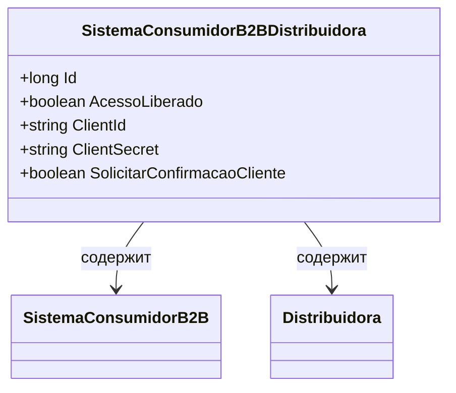

# SistemaConsumidorB2BDistribuidora
**Namespace**: IsthmusWinthor.Dominio.Entidades  
**Nome do Arquivo**: SistemaConsumidorB2BDistribuidora.cs  

## Visão Geral e Responsabilidade
A classe `SistemaConsumidorB2BDistribuidora` atua como um modelo de domínio que representa uma associação entre um sistema consumidor B2B e uma distribuidora. Sua principal responsabilidade é gerenciar as credenciais e permissões de acesso concedidas a um sistema consumidor específico por uma distribuidora, garantindo que apenas os usuários autorizados possam interagir com esses sistemas.

## Métodos de Negócio
Neste trecho de código não foram identificados métodos de negócio com lógica específica, além de propriedades que utilizam get/set diretos.

## Propriedades Calculadas e de Validação
Não há propriedades calculadas ou validações no código fornecido.

## Navigation Property
- `SistemaConsumidorB2B`: [SistemaConsumidorB2B](SistemaConsumidorB2B.md)  
- `Distribuidora`: [Distribuidora](Distribuidora.md)  

## Tipos Auxiliares e Dependências
Nesta classe não foram encontrados enumeradores ou classes estáticas/helpers.

## Diagrama de Relacionamentos

---
Gerada em 29/12/2025 20:50:05
